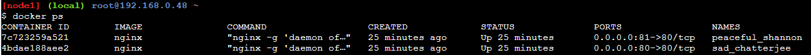
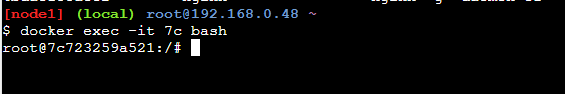
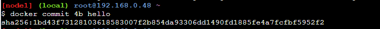
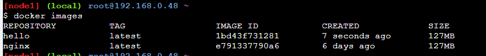

# 常用命令

记录Docker常用命令

Docker有一个官方的镜像仓库，地址为：https://hub.docker.com/

但是由于速度访问不理想，所以国内有很多镜像站，比如：

- [中国科学技术大学镜像站](https://lug.ustc.edu.cn/wiki/mirrors/help/docker)
- [七牛云镜像站](https://hub.qiniu.com/home)

配置镜像后可以提高拉取镜像速度。

推荐一个在线练习 Docker 的网站：https://labs.play-with-docker.com/

可以给免费四小时使用时间

#### 拉取镜像

使用 `docker pull` 命令，比如：

```
docker pull ubuntu
docker pull nginx:latest
```

可以快速拉取 `Ubuntu` 的镜像，如果后面不加版本，则默认拉取 `latest` 版本.

#### 查看镜像

1. 使用 `docker images` 可以查看本地有哪些镜像
2. 使用 `docker ps`  可以查看当前运行的容器有哪些

#### 运行镜像

比如要运行`ngxinx`镜像，使用 `docker run` 命令：

```
docker run -d -p 81:80 nginx
```

其中参数为：

- `-d`代表后台运行，不阻塞当前的shell指令窗口
- `-p` 来制定端口映射，比如上面的命令中，把docker内部的 `80` 端口，指定到了主机的 `81` 端口（先外后内）。
- `--name` 指定一个名字
- `-v` 映射文件

比如：

```
docker run -d -p 88:80 --name mynginx -v `pwd`:/usr/share/nginx/html nginx:latest
```

这样就可以把当前路径映射到`/usr/share/nginx/html`，可以把静态文件放在外面。

#### 进入正在运行的容器

我们首先使用 `docker ps` 命令来查看正在运行的容器：



使用 `docker exec -it 容器id bash` 来进入容器：



这样就可以进入一个容器的命令行

#### 删除镜像

使用 `docker rm -f 容器id`  强制删除一个镜像

#### 提交镜像

```
docker commit 现有镜像id 新镜像名称
```



上图我们把现有的一个镜像，生成了一个新镜像 `hello`

在通过 `docker images` 来查看的话，是已经有的。



#### 通过 `Dockerfile` 构建镜像


#### 将镜像保存在文件中和加载镜像

通过 `docker save` 可以把已有的镜像打包进一个文件中，比如：

```
docker save hello > hello.tar
```

就把 `hello` 保存成了一个 `hello.tar`

再通过:

```
docker load < hello.tar
```

就把可以加载一个镜像。


