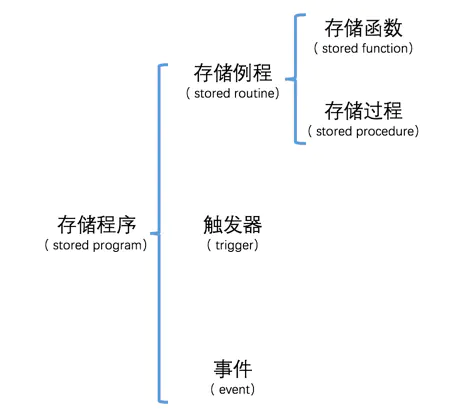

# MySQL 学习笔记

## SQL 语句与种类

- DDL（Data Definition Language）数据库定义语言：如 create drop alter
- DML（Data Manipulation Language）数据操纵语言：如 select insert update delete
- DCL（Data Control Language）数据控制语言：如 commit rollback grant revoke

我们使用的 SQL 语句中，有 90% 属于 DML

## MySQL 数据类型

整数类型：

|           类型           | 占用的存储空间（单位：字节） | 无符号数取值范围 | 有符号数取值范围 |      含义      |
| :----------------------: | :--------------------------: | :--------------: | :--------------: | :------------: |
|        `TINYINT`         |              1               |     0 ~ 2⁸-1     |    -2⁷ ~ 2⁷-1    |  非常小的整数  |
|        `SMALLINT`        |              2               |    0 ~ 2¹⁶-1     |   -2¹⁵ ~ 2¹⁵-1   |    小的整数    |
|       `MEDIUMINT`        |              3               |    0 ~ 2²⁴-1     |   -2²³ ~ 2²³-1   | 中等大小的整数 |
| `INT`（别名：`INTEGER`） |              4               |    0 ~ 2³²-1     |   -2³¹ ~ 2³¹-1   |   标准的整数   |
|         `BIGINT`         |              8               |    0 ~ 2⁶⁴-1     |   -2⁶³ ~ 2⁶³-1   |     大整数     |

浮点类型：

|   类型   | 占用的存储空间（单位：字节） |     绝对值最小非0值      |     绝对值最大非0值      |     含义     |
| :------: | :--------------------------: | :----------------------: | :----------------------: | :----------: |
| `FLOAT`  |              4               |     ±1.175494351E-38     |     ±3.402823466E+38     | 单精度浮点数 |
| `DOUBLE` |              8               | ±2.2250738585072014E-308 | ±1.7976931348623157E+308 | 双精度浮点数 |

定点数类型：

|      类型       | 占用的存储空间（单位：字节） |  取值范围  |
| :-------------: | :--------------------------: | :--------: |
| `DECIMAL(M, D)` |          取决于M和D          | 取决于M和D |

日期和时间类型：

|    类型     | 存储空间要求 |                    取值范围                    |     含义     |
| :---------: | :----------: | :--------------------------------------------: | :----------: |
|   `YEAR`    |    1字节     |                   1901~2155                    |    年份值    |
|   `DATE`    |    3字节     |          '1000-01-01' ~ '9999-12-31'           |    日期值    |
|   `TIME`    |    3字节     |           '-838:59:59' ~ '838:59:59'           |    时间值    |
| `DATETIME`  |    8字节     | '1000-01-01 00:00:00' ～ '9999-12-31 23:59:59' | 日期加时间值 |
| `TIMESTAMP` |    4字节     | '1970-01-01 00:00:01' ～ '2038-01-19 03:14:07' |    时间戳    |

字符串类型：

|     类型     |   最大长度   |   存储空间要求    |       含义       |
| :----------: | :----------: | :---------------: | :--------------: |
|  `CHAR(M)`   |   M个字符    |     M×W个字节     | 固定长度的字符串 |
| `VARCHAR(M)` |   M个字符    | L+1 或 L+2 个字节 | 可变长度的字符串 |
|  `TINYTEXT`  | 2⁸-1 个字节  |     L+1个字节     | 非常小型的字符串 |
|    `TEXT`    | 2¹⁶-1 个字节 |    L+2 个字节     |   小型的字符串   |
| `MEDIUMTEXT` | 2²⁴-1 个字节 |     L+3个字节     | 中等大小的字符串 |
|  `LONGTEXT`  | 2³²-1 个字节 |     L+4个字节     |   大型的字符串   |

枚举类型ENUM：它表示在给定的字符串列表里选择一个

```
ENUM('str1', 'str2', 'str3' ⋯)
```

SET类型，表示在给定的字符串列表里选择多个：

```
SET('str1', 'str2', 'str3' ⋯)
```

二进制类型：

|   类型   |    字节数     |       含义        |
| :------: | :-----------: | :---------------: |
| `BIT(M)` | 近似为(M+7)/8 | 存储M个比特位的值 |

## 数据库的基本操作

- 展示数据库：`SHOW DATABASES;`
- 创建数据库：`CREATE DATABASE 数据库名;`，可以在创建前先判断是否存在 `CREATE DATABASE IF NOT EXISTS 数据库名;`
- 切换数据库：`USE 数据库名称;`
- 删除数据库：`DROP DATABASE 数据库名;`，可以先判断是否存在：`DROP DATABASE IF EXISTS 数据库名;`

## 表的基本操作

- 展示数据库中有哪些表：`SHOW TABLES;`

- 创建表：

  ```sql
  CREATE TABLE 表名 (
      列名1    数据类型    [列的属性],
      列名2    数据类型    [列的属性],
      ...
      列名n    数据类型    [列的属性]
  );
  
  CREATE TABLE 表名 (
      各个列的信息 ...
  ) COMMENT '表的注释信息';
  
  CREATE TABLE IF NOT EXISTS 表名(
      各个列的信息 ...
  );
  ```

- 删除表：`DROP TABLE 表1, 表2, ..., 表n;`

- 查看表结构：

  ```sql
  DESCRIBE 表名;
  DESC 表名;
  EXPLAIN 表名;
  SHOW COLUMNS FROM 表名;
  SHOW FIELDS FROM 表名;
  ```

### 查看表创建语句: 

```sql
SHOW CREATE TABLE 表名; 
SHOW CREATE TABLE 表名\G; # 显示效果好点
```

### 使用`utf8`字符集建库

utf8字符集是残缺的只有三个字节，utf8mb4 占4个字节，里面可以存储所有的utf8字符。

```sql
create database xiaohaizi character set utf8mb4;
create database IF NOT EXISTS xiaohaizi character set utf8mb4; # 不存在才建立
```

### 修改表名

```sql
ALTER TABLE 旧表名 RENAME TO 新表名;
RENAME TABLE 旧表名1 TO 新表名1, 旧表名2 TO 新表名2, ... 旧表名n TO 新表名n;
```

还可以把一个数据库中的表转移到另一个数据库中：

```sql
RENAME TABLE dahaizi.first_table1 TO xiaohaizi.first_table;
```

### 增加表中的列

```sql
ALTER TABLE 表名 ADD COLUMN 列名 数据类型 [列的属性];

例子：
ALTER TABLE first_table ADD COLUMN third_column CHAR(4) ;
```

默认mysql会添加在最后一列，如果想要添加到第一列，可以这样：

```sql
ALTER TABLE 表名 ADD COLUMN 列名 列的类型 [列的属性] FIRST;
```

添加在指定列名的后面：

```sql
ALTER TABLE 表名 ADD COLUMN 列名 列的类型 [列的属性] AFTER 指定列名;
```

### 删除列

```sql
ALTER TABLE 表名 DROP COLUMN 列名;
```

### 修改列的信息：

方式1：

```sql
ALTER TABLE 表名 MODIFY 列名 新数据类型 [新属性];
```

注意：修改后的数据类型和属性一定要兼容表中现有的数据

方式2：

这种修改方式需要我们填两个列名，也就是说在修改数据类型和属性的同时也可以修改列名

```sql
ALTER TABLE 表名 CHANGE 旧列名 新列名 新数据类型 [新属性];
```

### 修改列排列位置

将列设为表的第一列：

```sql
ALTER TABLE 表名 MODIFY 列名 列的类型 列的属性 FIRST;
```

将列放到指定列的后边：

```sql
ALTER TABLE 表名 MODIFY 列名 列的类型 列的属性 AFTER 指定列名;
```

### 一条语句中包含多个修改操作

如果对同一个表有多个修改操作的话，我们可以把它们放到一条语句中执行，就像这样：

```sql
ALTER TABLE 表名 操作1, 操作2, ..., 操作n;
```

## 列的属性

### 简单查询语句：

```sql
SELECT * FROM 表名;
```

### 简单插入语句：

```sql
INSERT INTO 表名(列1, 列2, ...) VALUES(列1的值，列2的值, ...);
# 批量插入
INSERT INTO 表名(列1,列2, ...) VAULES(列1的值，列2的值, ...), (列1的值，列2的值, ...), (列1的值，列2的值, ...), ...;
```

### 默认值

在书写`INSERT`语句插入记录的时候可以只指定部分的列，那些没有被显式指定的列的值将被设置为`NULL`，换一种说法就是列的默认值为`NULL`，`NULL`的含义是这个列的值还没有被设置。如果我们不想让默认值为`NULL`，而是设置成某个有意义的值，可以在定义列的时候给该列增加一个`DEFAULT`属性，就像这样：

```sql
列名 列的类型 DEFAULT 默认值
```

### NOT NULL属性

有时候我们需要要求表中的某些列中必须有值，不能存放`NULL`，那么可以用这样的语法来定义这个列：

```
列名 列的类型 NOT NULL
```

### 主键

有时候在我们的表里可以通过某个列或者某些列确定唯一的一条记录，我们就可以把这个列或者这些列称为`候选键`。比如在学生信息表`student_info`中，只要我们知道某个学生的学号，就可以确定一个唯一的学生信息，也就是一条记录。当然，我们也可以通过身份证号来确定唯一的一条学生信息记录，所以`学号`和`身份证号`都可以作为学生信息表的`候选键`。在学生成绩表`student_score`中，我们可以通过`学号`和`科目`这两个列的组合来确定唯一的一条成绩记录，所以`学号、科目`这两个列的组合可以作为学生成绩表的`候选键`。

**一个表可能有多个候选键，我们可以选择一个候选键作为表的`主键`。一个表最多只能有一个主键，主键的值不能重复，通过主键可以找到唯一的一条记录**

主键可以通过两种方式进行声明：

1. 如果主键只是单个列的话，可以直接在该列后声明`PRIMARY KEY`

2. 也可以把主键的声明单独提取出来，用这样的形式声明：

   ```sql
   PRIMARY KEY (列名1, 列名2, ...)
   ```

   对于多个列的组合作为主键的情况，必须使用这种单独声明的形式

主键默认具有 `NOT NULL` 属性。

### UNIQUE属性

对于不是主键的其他候选键，如果也想让`MySQL`在我们向表中插入新记录的时候帮助我们校验一下某个列或者列组合的值是否重复，那么我们可以把这个列或列组合添加一个`UNIQUE`属性，表明该列或者列组合的值是不允许重复的。

声明方式也是两种：

1. 如果我们想为单个列声明`UNIQUE`属性，可以直接在该列后填写`UNIQUE`或者`UNIQUE KEY`

2. 也可以把`UNIQUE`属性的声明单独提取出来

   ```
   UNIQUE [约束名称] (列名1, 列名2, ...)
   或
   UNIQUE KEY [约束名称] (列名1, 列名2, ...)
   ```

如果表中为某个列或者列组合定义了`UNIQUE`属性的话，`MySQL`会对我们插入的记录做校验，如果新插入记录在该列或者列组合的值已经在表中存在了，那就会报错！

### 主键和UNIQUE约束的区别

1. 一张表中只能定义一个主键，却可以定义多个`UNIQUE`约束！
2. 规定：主键列不允许存放NULL，而声明了`UNIQUE`属性的列可以存放`NULL`，而且`NULL`可以重复地出现在多条记录中！

### 外键

定义外键的语法：

```sql
CONSTRAINT [外键名称] FOREIGN KEY(列1, 列2, ...) REFERENCES 父表名(父列1, 父列2, ...);
```

其中的`外键名称`也是可选的。如果A表中的某个列或者某些列依赖与B表中的某个列或者某些列，那么就称A表为`子表`，B表为`父表`。子表和父表可以使用外键来关联起来。

> 父表中被子表依赖的列或者列组合必须建立索引，如果该列或者列组合已经是主键或者有UNIQUE属性，那么它们也就被默认建立了索引。示例中student_score表依赖于stuent_info表的number列，而number列又是stuent_info的主键（注意上一章定义的student_info结构中没有把number列定义为主键，本章才将其定义为主键，如果你的机器上还没有将其定义为主键的话，赶紧修改表结构呗～），所以在student_score表中创建外键是没问题的。

### AUTO_INCREMENT属性

`AUTO_INCREMENT`翻译成中文可以理解为`自动增长`，简称自增。如果一个表中的某个列的数据类型是整数类型或者浮点数类型，那么这个列可以设置`AUTO_INCREMENT`属性。当我们把某个列设置了`AUTO_INCREMENT`属性之后，如果我们在插入新记录的时候不指定该列的值，或者将该列的值显式地指定为`NULL`或者`0`，那么新插入的记录在该列上的值就是当前该列的最大值加1后的值，定义语法为：

```
列名 列的类型 AUTO_INCREMENT
```

列`id`是从1开始递增的。在为列定义`AUTO_INCREMENT`属性的时候需要注意这几点：

1. 一个表中最多有一个具有AUTO_INCREMENT属性的列。
2. 具有AUTO_INCREMENT属性的列必须建立索引。主键和具有`UNIQUE`属性的列会自动建立索引。不过至于什么是索引，在学习MySQL进阶的时候才会介绍。
3. 拥有AUTO_INCREMENT属性的列就不能再通过指定DEFAULT属性来指定默认值。
4. 一般拥有AUTO_INCREMENT属性的列都是作为主键的属性，来自动生成唯一标识一条记录的主键值。

### 列的注释

上一章中我们说了在建表语句的末尾可以添加`COMMENT`语句来给表添加注释，其实我们也可以在每一个列末尾添加`COMMENT`语句来为列来添加注释，比方说：

```
CREATE TABLE first_table (
    id int UNSIGNED AUTO_INCREMENT PRIMARY KEY COMMENT '自增主键',
    first_column INT COMMENT '第一列',
    second_column VARCHAR(100) DEFAULT 'abc' COMMENT '第二列'
) COMMENT '第一个表';
```

### 影响展示外观的ZEROFILL属性

下边是正整数`3`的三种写法：

- 写法一：`3`
- 写法二：`003`
- 写法三：`000003`

对于无符号整数类型的列，我们可以在查询数据的时候让数字左边补0，如果想实现这个效果需要给该列加一个`ZEROFILL`属性（也可以理解为这是一个属于数据类型的属性），就像这样：

```
mysql> CREATE TABLE zerofill_table (
    ->     i1 INT UNSIGNED ZEROFILL,
    ->     i2 INT UNSIGNED
    -> );
Query OK, 0 rows affected (0.03 sec)
```

`显示宽度`。`显示宽度`是在查询语句显示的结果中，如果声明了 **ZEROFILL** 属性的整数列的实际值的位数小于显示宽度时，会在实际值的左侧补0，使补0的位数和实际值的位数相加正好等于显示宽度。我们也可以自己指定显示宽度

- 在展示查询结果时，某列数据自动补0的条件有这几个：

  - 该列必须是整数类型的
  - 该列必须有`UNSIGNED ZEROFILL`的属性
  - 该列的实际值的位数必须小于显示宽度

- 在创建表的时候，如果声明了`ZEROFILL`属性的列没有声明`UNSIGNED`属性，那`MySQL`会为该列自动生成`UNSIGNED`属性。

  也就是说如果我们创建表语句是这样的：

  ```
  CREATE TABLE zerofill_table (
      i1 INT ZEROFILL,
      i2 INT UNSIGNED
  );
  ```

  `MySQL`会自动帮我们为`i1`列加上`UNSIGNED`属性，也就是这样：

  ```
  CREATE TABLE zerofill_table (
      i1 INT UNSIGNED ZEROFILL,
      i2 INT UNSIGNED
  );
  ```

  也就是说`MySQL`现在只支持对无符号整数进行自动补0的操作。

- 每个整数类型都会有默认的显示宽度。

  比如`TINYINT`的默认显示宽度是`4`，`INT`的默认显示宽度是`(11)`... 如果加了`UNSIGNED`属性，则该类型的显示宽度减1，比如`TINYINT UNSIGNED`的显示宽度是`3`，`INT UNSIGNED`的显示宽度是`10`。

- 显示宽度并不会影响实际类型的实际存储空间。

  显示宽度仅仅是在展示查询结果时，如果整数的位数不够显示宽度的情况下起作用的，并不影响该数据类型要求的存储空间以及该类型能存储的数据范围，也就是说`INT(1)`和`INT(10)`仅仅在展示时可能有区别，在别的方面没有任何区别。比方说`zerofill_table`表中`i1`列的显示宽度是5，而数字`12345678`的位数是8，它照样可以被填入`i1`列中：

  ```
  mysql> INSERT INTO zerofill_table(i1, i2) VALUES(12345678, 12345678);
  Query OK, 1 row affected (0.01 sec)
  
  mysql>
  ```

- 只有列的实际值的位数小于显示宽度时才会补0，实际值的位数大于显示宽度时照原样输出。

  比方说我们刚刚把`12345678`存到了`i1`列里，在展示这个值时，并不会截短显示的数据，而是照原样输出：

  ```
  mysql> SELECT * FROM zero_table;
  +----------+----------+
  | i1       | i2       |
  +----------+----------+
  |    00001 |        1 |
  | 12345678 | 12345678 |
  +----------+----------+
  2 rows in set (0.00 sec)
  
  mysql>
  ```

- 对于没有声明`ZEROFILL`属性的列，显示宽度没有一毛钱卵用。

  只有在查询声明了`ZEROFILL`属性的列时，显示宽度才会起作用，否则忽略显示宽度这个东西的存在。

### 一个列同时具有多个属性

每个列可以同时具有多个属性，属性声明的顺序无所谓，各个属性之间用空白隔开就好了～

### 查看表结构时的列属性

```
mysql> DESC student_info;
+-----------------+-------------------+------+-----+---------+-------+
| Field           | Type              | Null | Key | Default | Extra |
+-----------------+-------------------+------+-----+---------+-------+
| number          | int(11)           | NO   | PRI | NULL    |       |
| name            | varchar(5)        | YES  |     | NULL    |       |
| sex             | enum('男','女')   | YES  |     | NULL    |       |
| id_number       | char(18)          | YES  | UNI | NULL    |       |
| department      | varchar(30)       | YES  |     | NULL    |       |
| major           | varchar(30)       | YES  |     | NULL    |       |
| enrollment_time | date              | YES  |     | NULL    |       |
+-----------------+-------------------+------+-----+---------+-------+
7 rows in set (0.00 sec)

mysql>
```

可以看到：

- `NULL`列代表该列是否可以存储`NULL`，值为`NO`时，表示不允许存储`NULL`，值为`YES`是表示可以存储`NULL`。
- `Key`列存储关于所谓的`键`的信息，当值为`PRI`是`PRIMARY KEY`的缩写，代表主键；`UNI`是`UNIQUE KEY`的缩写，代表`UNIQUE`属性。
- `Default`列代表该列的默认值。
- `Extra`列展示一些额外的信息。比方说如果某个列具有`AUTO_INCREMENT`属性就会被展示在这个列里。

## 简单查询

### 查询单个列

```sql
SELECT 列名 FROM 表名;
```

### 列的别名

我们也可以为结果集中的列重新定义一个`别名`，命令格式如下：

```sql
SELECT 列名 [AS] 列的别名 FROM 表名;
```

### 查询多个列

如果想查询多个列的数据，可以在`SELECT`后边写多个列名，用逗号`,`分隔开就好：

```sql
SELECT 列名1, 列名2, ... 列名n FROM 表名;
```

我们把`SELECT`语句后边跟随的多个列统称为`查询列表`，需要注意的是，查询列表中的列名可以按任意顺序摆放，结果集将按照我们指定的列名顺序显示

### 查询所有列

```sql
SELECT * FROM 表名;
```

需要注意的是，除非你确实需要表中的每个列，否则一般最好别使用星号`*`来查询所有列，虽然星号`*`看起来很方便，不用明确列出所需的列，但是查询不需要的列通常会降低性能。

### 查询结果去重

#### 去除单列的重复结果

```sql
SELECT DISTINCT 列名 FROM 表名;
```

#### 去除多列的重复结果

```sql
SELECT DISTINCT 列名1, 列名2, ... 列名n  FROM 表名;
```

### 限制查询结果条数

有时候查询结果的条数会很多，都显示出来可能会撑爆屏幕～ 所以`MySQL`给我们提供了一种限制结果集中的记录条数的方式，就是在查询语句的末尾使用这样的语法：

```sql
LIMIT 开始行, 限制条数;
```

`开始行`指的是我们想从第几行数据开始查询，`限制条数`是结果集中最多包含多少条记录。

`LIMIT` 后面也可以直接跟数字，代表开始行为 0

### 对查询结果排序

#### 按照单个列的值进行排序

我们可以用下边的语法来指定返回结果的记录按照某一列的值进行排序：

```sql
ORDER BY 列名 ASC|DESC
```

- `ASC`和`DESC`指的是排序方向。

- `ASC`是指按照指定列的值进行**由小到大**进行排序，也叫做`升序`

- `DESC`是指按照指定列的值进行**由大到小**进行排序，也叫做`降序`，中间的`|`表示这两种方式只能选一个

#### 按照多个列的值进行排序

```sql
ORDER BY 列1 ASC|DESC, 列2 ASC|DESC ...
```

- 如果不指定排序方向，则默认使用的是`ASC`，也就是从小到大的升序规则。

### 带搜索条件的查询

#### 使用 `where` 子句

形如：`SELECT number, name, id_number, major FROM student_info WHERE name = '范剑';`

`MySQL`还提供了很多别的比较操作符，比如：

|    操作符     |          示例           |        描述        |
| :-----------: | :---------------------: | :----------------: |
|      `=`      |         `a = b`         |       a等于b       |
| `<>`或者`!=`  |        `a <> b`         |      a不等于b      |
|      `<`      |         `a < b`         |       a小于b       |
|     `<=`      |        `a <= b`         |    a小于或等于b    |
|      `>`      |         `a > b`         |       a大于b       |
|     `>=`      |        `a >= b`         |    a大于或等于b    |
|   `BETWEEN`   |   `a BETWEEN b AND c`   |  满足 b <= a <= c  |
| `NOT BETWEEN` | `a NOT BETWEEN b AND c` | 不满足 b <= a <= c |

#### 匹配列表中的元素：

|  操作符  |           示例           |             描述              |
| :------: | :----------------------: | :---------------------------: |
|   `IN`   |   `a IN (b1, b2, ...)`   |   a是b1, b2, ... 中的某一个   |
| `NOT IN` | `a NOT IN (b1, b2, ...)` | a不是b1, b2, ... 中的任意一个 |

#### 匹配`NULL`值

|    操作符     |      示例       |      描述       |
| :-----------: | :-------------: | :-------------: |
|   `IS NULL`   |   `a IS NULL`   |  a的值是`NULL`  |
| `IS NOT NULL` | `a IS NOT NULL` | a的值不是`NULL` |

#### 多个搜索条件

使用 `AND` 或者 `OR` 操作符吗，其中 `AND` 的优先级比较大

#### 通配符

通常用来进行模糊查询

|   操作符   |      示例      |   描述   |
| :--------: | :------------: | :------: |
|   `LIKE`   |   `a LIKE b`   |  a匹配b  |
| `NOT LIKE` | `a NOT LIKE b` | a不匹配b |

MySQL支持两种通配符：

1. `%`：代表任意一个字符串。
2. `_`：代表任意一个字符。

如果待匹配的字符包含 `%` 或者 `_` ，则可以使用 `\` 进行转义

## 表达式和函数

### 操作数

`MySQL`中`操作数`可以是下边这几种类型：

1. 常数

   常数很好理解，我们平时用到的数字、字符串、时间值什么的都可以被称为常数，它是一个确定的值，比如数字`1`，字符串`'abc'`，时间值`2019-08-16 17:10:43`啥的。

2. 列名

   针对某个具体的表，它的列名可以被当作表达式的一部分，比如对于`student_info`表来说，`number`、`name`都可以作为`操作数`。

3. 函数调用

   `MySQL`中有`函数`的概念，比方说获取当前时间的函数`NOW`，而在函数后边加个小括号就算是一个`函数调用`，比如`NOW()`。

4. 标量子查询或者行子查询

5. 其他表达式

   一个表达式也可以作为一个操作数与另一个操作数来形成一个更复杂的表达式，比方说（假设`col`是一个列名）：

   - (col - 5) / 3
   - (1 + 1) * 2 + col * 3

### 操作符

1. 算术操作符

   | 操作符 |   示例    |         描述         |
   | :----: | :-------: | :------------------: |
   |  `+`   |  `a + b`  |         加法         |
   |  `-`   |  `a - b`  |         减法         |
   |  `*`   |  `a * b`  |         乘法         |
   |  `/`   |  `a / b`  |         除法         |
   | `DIV`  | `a DIV b` | 除法，取商的整数部分 |
   |  `%`   |  `a % b`  |         取余         |
   |  `-`   |   `-a`    |         负号         |

   在使用`MySQL`中的`算术操作符`时需要注意，`DIV`和`/`都表示除法操作符，但是`DIV`只会取商的整数部分，`/`会保留商的小数部分。比如表达式 `2 DIV 3`的结果是`0`，而`2 / 3`的结果是`0.6667`。

2. 比较操作符

   |    操作符     |           示例           |             描述              |
   | :-----------: | :----------------------: | :---------------------------: |
   |      `=`      |         `a = b`          |            a等于b             |
   | `<>`或者`!=`  |         `a <> b`         |           a不等于b            |
   |      `<`      |         `a < b`          |            a小于b             |
   |     `<=`      |         `a <= b`         |         a小于或等于b          |
   |      `>`      |         `a > b`          |            a大于b             |
   |     `>=`      |         `a >= b`         |         a大于或等于b          |
   |   `BETWEEN`   |   `a BETWEEN b AND c`    |       满足 b <= a <= c        |
   | `NOT BETWEEN` | `a NOT BETWEEN b AND c`  |      不满足 b <= a <= c       |
   |     `IN`      |   `a IN (b1, b2, ...)`   |   a是b1, b2, ... 中的某一个   |
   |   `NOT IN`    | `a NOT IN (b1, b2, ...)` | a不是b1, b2, ... 中的任意一个 |
   |   `IS NULL`   |       `a IS NULL`        |         a的值是`NULL`         |
   | `IS NOT NULL` |     `a IS NOT NULL`      |        a的值不是`NULL`        |
   |    `LIKE`     |        `a LIKE b`        |            a匹配b             |
   |  `NOT LIKE`   |      `a NOT LIKE b`      |           a不匹配b            |

   由`比较操作符`连接而成的表达式也称为`布尔表达式`，表示`真`或者`假`，也可以称为`TRUE`或者`FALSE`。比如`1 > 3`就代表`FALSE`，`3 != 2`就代表`TRUE`。

3. 逻辑操作符

   | 操作符 |   示例    |                 描述                 |
   | :----: | :-------: | :----------------------------------: |
   | `AND`  | `a AND b` |    只有a和b同时为真，表达式才为真    |
   |  `OR`  | `a OR b`  | 只要a或b有任意一个为真，表达式就为真 |
   | `XOR`  | `a XOR b` |   a和b有且只有一个为真，表达式为真   |

### 表达式的使用

只要把这些`操作数`和`操作符`相互组合起来就可以组成一个`表达式`。`表达式`主要以下边这两种方式使用：

1. 放在查询列表中

   我们前边都是将列名放在查询列表中的(`*`号代表所有的列名～)。列名只是`表达式`中超级简单的一种，我们可以将任意一个表达式作为查询列表的一部分来处理，比方说我们可以在查询`student_score`表时把`score`字段的数据都加`100`，就像这样：

   ```sql
   SELECT  number, subject, score + 100 FROM student_score;
   ```

   需要注意的是，放在查询列表的表达式也可以不涉及列名，就像这样：

   ```sql
   SELECT 1 FROM student_info;
   ```

2. 作为搜索条件

   搜索条件也可以不带列名，比如这样：

   ```sql
   SELECT number, name, id_number, major FROM student_info WHERE 2 > 1;
   ```

### 函数

在使用`MySQL`过程中经常会有一些需求，比方说将给定文本中的小写字母转换成大写字母，把某个日期数据中的月份值提取出来等等。为了解决这些常遇到的问题，`MySQL`提供了很多所谓的`函数`：

- `UPPER`函数是用来把给定的文本中的小写字母转换成大写字母。
- `MONTH`函数是用来把某个日期数据中的月份值提取出来。
- `NOW`函数用来获取当前的日期和时间。

#### 文本处理函数：

|    名称     |           调用示例            |  示例结果   |                  描述                  |
| :---------: | :---------------------------: | :---------: | :------------------------------------: |
|   `LEFT`    |      `LEFT('abc123', 3)`      |    `abc`    |    给定字符串从左边取指定长度的子串    |
|   `RIGHT`   |     `RIGHT('abc123', 3)`      |    `123`    |    给定字符串从右边取指定长度的子串    |
|  `LENGTH`   |        `LENGTH('abc')`        |     `3`     |            给定字符串的长度            |
|   `LOWER`   |        `LOWER('ABC')`         |    `abc`    |          给定字符串的小写格式          |
|   `UPPER`   |        `UPPER('abc')`         |    `ABC`    |          给定字符串的大写格式          |
|   `LTRIM`   |        `LTRIM(' abc')`        |    `abc`    |     给定字符串左边空格去除后的格式     |
|   `RTRIM`   |        `RTRIM('abc ')`        |    `abc`    |     给定字符串右边空格去除后的格式     |
| `SUBSTRING` |  `SUBSTRING('abc123', 2, 3)`  |    `bc1`    | 给定字符串从指定位置截取指定长度的子串 |
|  `CONCAT`   | `CONCAT('abc', '123', 'xyz')` | `abc123xyz` |  将给定的各个字符串拼接成一个新字符串  |

#### 日期和时间处理函数：

|     名称      |                     调用示例                      |       示例结果        |                             描述                             |
| :-----------: | :-----------------------------------------------: | :-------------------: | :----------------------------------------------------------: |
|     `NOW`     |                      `NOW()`                      | `2019-08-16 17:10:43` |                      返回当前日期和时间                      |
|   `CURDATE`   |                    `CURDATE()`                    |     `2019-08-16`      |                         返回当前日期                         |
|   `CURTIME`   |                    `CURTIME()`                    |      `17:10:43`       |                         返回当前时间                         |
|    `DATE`     |           `DATE('2019-08-16 17:10:43')`           |     `2019-08-16`      |               将给定日期和时间值的日期提取出来               |
|  `DATE_ADD`   | `DATE_ADD('2019-08-16 17:10:43', INTERVAL 2 DAY)` | `2019-08-18 17:10:43` |            将给定的日期和时间值添加指定的时间间隔            |
|  `DATE_SUB`   | `DATE_SUB('2019-08-16 17:10:43', INTERVAL 2 DAY)` | `2019-08-14 17:10:43` |            将给定的日期和时间值减去指定的时间间隔            |
|  `DATEDIFF`   |      `DATEDIFF('2019-08-16', '2019-08-17');`      |         `-1`          | 返回两个日期之间的天数（负数代表前一个参数代表的日期比较小） |
| `DATE_FORMAT` |          `DATE_FORMAT(NOW(),'%m-%d-%Y')`          |     `08-16-2019`      |                  用给定的格式显示日期和时间                  |

在使用`DATE_ADD`和`DATE_SUB`这两个函数时需要注意，增加或减去的时间间隔单位可以自己定义，下边是`MySQL`支持的一些时间单位：

|   时间单位    | 描述 |
| :-----------: | :--: |
| `MICROSECOND` | 毫秒 |
|   `SECOND`    |  秒  |
|   `MINUTE`    | 分钟 |
|    `HOUR`     | 小时 |
|     `DAY`     |  天  |
|    `WEEK`     | 星期 |
|    `MONTH`    |  月  |
|   `QUARTER`   | 季度 |
|    `YEAR`     |  年  |

如果我们相让`2019-08-16 17:10:43`这个时间值增加2分钟，可以这么写：

```sql
SELECT DATE_ADD('2019-08-16 17:10:43', INTERVAL 2 MINUTE);
```

在使用`DATE_FORMAT`函数时需要注意，我们可以通过一些所谓的`格式符`来自定义日期和时间的显示格式，下边是`MySQL`中常用的一些日期和时间的格式符以及它们对应的含义：

| 格式符 |                          描述                           |
| :----: | :-----------------------------------------------------: |
|  `%b`  |           简写的月份名称（Jan、Feb、...、Dec)           |
|  `%D`  | 带有英文后缀的月份中的日期（0th、1st、2nd、...、31st)） |
|  `%d`  |       数字格式的月份中的日期(00、01、02、...、31)       |
|  `%f`  |                  微秒（000000-999999）                  |
|  `%H`  |               二十四小时制的小时 (00-23)                |
|  `%h`  |                十二小时制的小时 (01-12)                 |
|  `%i`  |                  数值格式的分钟(00-59)                  |
|  `%M`  |       月份名（January、February、...、December）        |
|  `%m`  |                  数值形式的月份(00-12)                  |
|  `%p`  |          上午或下午（AM代表上午、PM代表下午）           |
|  `%S`  |                        秒(00-59)                        |
|  `%s`  |                        秒(00-59)                        |
|  `%W`  |         星期名（Sunday、Monday、...、Saturday）         |
|  `%w`  |      周内第几天 （0=星期日、1=星期一、 6=星期六）       |
|  `%Y`  |               4位数字形式的年（例如2019）               |
|  `%y`  |                2位数字形式的年（例如19）                |

可以把我们想要的显示格式用对应的格式符描述出来，就像这样：

```sql
SELECT DATE_FORMAT(NOW(),'%b %d %Y %h:%i %p');
```

`'%b %d %Y %h:%i %p'`就是一个用格式符描述的显示格式，意味着对应的日期和时间应该以下边描述的方式展示：

- 先输出简写的月份名称（格式符`%b`），也就是示例中的`Aug`，然后输出一个空格。
- 再输出用数字格式表示的的月份中的日期（格式符`%d`），也就是示例中的`16`，然后输出一个空格。
- 再输出4位数字形式的年（格式符`%Y`），也就是示例中的`2019`，然后输出一个空格。
- 再输出十二小时制的小时（格式符`%h`），也就是示例中的`05`，然后输出一个冒号`:`。
- 再输出数值格式的分钟（格式符`%i`），也就是示例中的`10`，然后输出一个空格。
- 最后输出上午或者下午（格式符`%p`），也就是示例中的`PM`。

#### 数值处理函数

|  名称  |   调用示例    |       示例结果       |        描述        |
| :----: | :-----------: | :------------------: | :----------------: |
| `ABS`  |   `ABS(-1)`   |         `1`          |      取绝对值      |
|  `Pi`  |    `PI()`     |      `3.141593`      |     返回圆周率     |
| `COS`  |  `COS(PI())`  |         `-1`         | 返回一个角度的余弦 |
| `EXP`  |   `EXP(1)`    | `2.718281828459045`  |  返回e的指定次方   |
| `MOD`  |  `MOD(5,2)`   |         `1`          |   返回除法的余数   |
| `RAND` |   `RAND()`    | `0.7537623539136372` |   返回一个随机数   |
| `SIN`  | `SIN(PI()/2)` |         `1`          | 返回一个角度的正弦 |
| `SQRT` |   `SQRT(9)`   |         `3`          | 返回一个数的平方根 |
| `TAN`  |   `TAN(0)`    |         `0`          | 返回一个角度的正切 |

#### 聚集函数

如果将上边介绍的那些函数以函数调用的形式放在查询列表中，那么会为表中符合`WHERE`条件的每一条记录调用一次该函数。

有些函数是用来统计数据的，比方说统计一下表中的行数，某一列数据的最大值是什么，我们把这种函数称之为`聚集函数`，下边介绍`MySQL`中常用的几种`聚集函数`：

| 函数名  |       描述       |
| :-----: | :--------------: |
| `COUNT` |  返回某列的行数  |
|  `MAX`  | 返回某列的最大值 |
|  `MIN`  | 返回某列的最小值 |
|  `SUM`  |  返回某列值之和  |
|  `AVG`  | 返回某列的平均值 |

`COUNT`函数使用来统计行数的，它有下边两种使用方式：

1. `COUNT(*)`：对表中行的数目进行计数，不管列的值是不是`NULL`。
2. `COUNT(列名)`：对特定的列进行计数，会忽略掉该列为`NULL`的行。

**两者的区别是会不会忽略统计列的值为NULL的行！**

聚集函数中DISTINCT的使用

默认情况下，上边介绍的聚集函数将计算指定列的所有非`NULL`数据，如果我们指定的列中有重复数据的话，可以选择使用`DISTINCT`来过滤掉这些重复数据。比方说我们想查看一下`student_info`表中存储了多少个专业的学生信息，就可以这么写：

```sql
SELECT COUNT(DISTINCT major) FROM student_info;
```

组合聚集函数

这些聚集函数也可以集中在一个查询中使用，比如这样：

```sql
SELECT COUNT(*) AS 成绩记录总数, MAX(score) AS 最高成绩, MIN(score) AS 最低成绩, AVG(score) AS 平均成绩 FROM student_score;
```

### 隐式类型转换

只要某个值的类型与上下文要求的类型不符，`MySQL`就会根据上下文环境中需要的类型对该值进行类型转换，由于这些类型转换都是`MySQL`自动完成的，所以也可以被称为`隐式类型转换`。我们列举几种常见的隐式类型转换的场景：

1. 把操作数类型转换为适合操作符计算的相应类型。

   比方说对于加法操作符`+`来说，它要求两个操作数都必须是数字才能进行计算，所以如果某个操作数不是数字的话，会将其隐式转换为数字，比方说下边这几个例子：

   ```
   1 + 2       →   3
   '1' + 2     →   3
   '1' + '2'   →   3
   ```

   虽然`'1'`、`'2'`都是字符串，但是如果它们作为加法操作符`+`的操作数的话，都会被强制转换为数字，所以上边几个表达式其实都会被当作`1 + 2`去处理的

2. 将函数参数转换为该函数期望的类型。

   我们拿用于拼接字符串的`CONCAT`函数举例，这个函数以字符串类型的值作为参数，如果我们在调用这个函数的时候，传入了别的类型的值作为参数，`MySQL`会自动把这些值的类型转换为字符串类型的：

   ```
   CONCAT('1', '2')    →   '12'
   CONCAT('1', 2)      →   '12'
   CONCAT(1, 2)        →   '12'
   ```

   虽然`1`、`2`都是数字，但是如果它们作为`CONCAT`函数的参数的话，都会被强制转换为字符串，所以上边几个表达式其实都会被当作`CONCAT('1', '2)`去处理的

3. 存储数据时，把某个值转换为某个列需要的类型。

#### 类型转换的注意事项

1. `MySQL`会尽量把值转换为表达式中需要的类型，而不是产生错误。

   按理说`'23sfd'`这个字符串无法转换为数字，但是`MySQL`规定只要字符串的开头部分包含数字，那么就把这个字符串转换为开头的数字，如果开头并没有包含数字，那么将被转换成`0`，比方说这样：

   ```
   '23sfd'         →   23
   '2019-08-28'    →   2019
   '11:30:32'      →   11
   'sfd'           →   0
   ```

   不过需要注意的是，这种强制转换不能用于存储数据中

2. 在运算时会自动提升操作数的类型。比如`TINYINT`最大能表示的数字是127，如果两个相加就会爆，所以MySQL会自动提升操作数的类型，让结果不爆。`MySQL`自动将整数类型的操作数提升到了`BIGINT`，这样就不会产生运算结果太大超过`TINYINT`能表示的数值范围的尴尬情况了。类似的，有浮点数的运算过程会把操作数自动转型为`DOUBLE`类型。

## 分组查询

`分组`的概念，就是：针对某个列，将该列的值相同的记录分到一个组中。

#### 创建分组

`subject`列中有多少不重复的课程，那就会有多少个分组。幸运的是，只要我们在`GROUP BY`子句中添加上`分组列`就好了，`MySQL`会帮助我们自动建立分组来方便我们统计信息，具体语句如下：

```sql
mysql> SELECT subject, AVG(score) FROM student_score GROUP BY subject;
+-----------------------------+------------+
| subject                     | AVG(score) |
+-----------------------------+------------+
| 母猪的产后护理              |    73.0000 |
| 论萨达姆的战争准备          |    73.2500 |
+-----------------------------+------------+
2 rows in set (0.01 sec)

```

这个查询的执行过程就是按照`subject`中的值将所有的记录分成两组，然后分别对每个分组中记录的`score`列调用`AVG`函数进行数据统计。

在使用`分组`的时候必须要意识到，分组的存在仅仅是为了方便我们分别统计各个分组中的信息，所以我们只需要把分组列和聚集函数放到查询列表处就好！当然，如果`非分组列`出现在查询列表中会出现什么情况呢？比如下边这个查询：

```sql
mysql> SELECT number, subject, AVG(score) FROM student_score GROUP BY subject;
ERROR 1055 (42000): Expression #1 of SELECT list is not in GROUP BY clause and contains nonaggregated column 'xiaohaizi.student_score.number' which is not functionally dependent on columns in GROUP BY clause; this is incompatible with sql_mode=only_full_group_by
```

可以看到出现了错误。为啥会错误呢？

本例中的查询列表处放置了既非分组列、又非聚集函数的`number`列。这样会产生不确定性，所以MySQL中不允许。

#### 带有WHERE子句的分组查询

这时就需要使用`WHERE`子句了。比如老师觉得各个科目的平均分太低了，所以想先把分数低于`60`分的记录去掉之后再统计平均分，就可以这么写：

```sql
mysql> SELECT subject, AVG(score) FROM student_score WHERE score >= 60 GROUP BY subject;
+-----------------------------+------------+
| subject                     | AVG(score) |
+-----------------------------+------------+
| 母猪的产后护理              |    89.0000 |
| 论萨达姆的战争准备          |    82.3333 |
+-----------------------------+------------+
2 rows in set (0.00 sec)
```

整个过程是，首先过滤掉不符合where条件的记录，然后再进行分组。

#### 作用于分组的过滤条件

`HAVING`子句，当分组有很多不重复的值时，我们需要的结果中并不需要这么多，我们只想把符合条件的分组加入到结果集。

```sql
mysql> SELECT subject, AVG(score) FROM student_score GROUP BY subject HAVING AVG(score) > 73;
+-----------------------------+------------+
| subject                     | AVG(score) |
+-----------------------------+------------+
| 论萨达姆的战争准备          |    73.2500 |
+-----------------------------+------------+
1 row in set (0.00 sec)
```

其实这里所谓的`针对分组的条件`一般是指下边这两种：

- 分组列

  也就是说我们可以把用于分组的列放到`HAVING`子句的条件中，比如这样：

  ```sql
  SELECT subject, AVG(score) FROM student_score GROUP BY subject having subject = '母猪的产后护理';
  ```

- 作用于分组的聚集函数

  当然，并不是`HAVING`子句中只能放置在查询列表出现的那些聚集函数，只要是针对这个分组进行统计的聚集函数都可以，比方说老师想查询最高分大于98分的课程的平均分，可以这么写：

  ```sql
  mysql> SELECT subject, AVG(score) FROM student_score GROUP BY subject HAVING MAX(score) > 98;
  +-----------------------+------------+
  | subject               | AVG(score) |
  +-----------------------+------------+
  | 母猪的产后护理        |    73.0000 |
  +-----------------------+------------+
  1 row in set (0.00 sec)
  
  mysql>
  ```

  其中的`MAX(score)`这个聚集函数并没有出现在查询列表中，但仍然可以作为`HAVING`子句中表达式的一部分。

#### 分组和排序

如果我们想对各个分组查询出来的统计数据进行排序，需要为查询列表中有聚集函数的表达式添加`别名`，比如想按照各个学科的平均分从大到小降序排序，可以这么写：

```sql
mysql> SELECT subject, AVG(score) AS avg_score FROM student_score GROUP BY subject ORDER BY avg_score DESC;
+-----------------------------+-----------+
| subject                     | avg_score |
+-----------------------------+-----------+
| 论萨达姆的战争准备          |   73.2500 |
| 母猪的产后护理              |   73.0000 |
+-----------------------------+-----------+
2 rows in set (0.01 sec)

mysql>
```

#### 嵌套分组

有时候按照某个列进行分组太笼统，一个分组内可以被继续划分成更小的分组。比方说对于`student_info`表来说

表结构如下：

```
+----------+--------+-----+--------------------+------------+------------------+-----------------+
| number   | name   | sex | id_number          | department | major            | enrollment_time |
+----------+--------+-----+--------------------+------------+------------------+-----------------+
| 20180101 | 杜子腾 | 男  | 158177199901044792 | 计算机学院 | 计算机科学与工程 | 2018-09-01      |
| 20180102 | 杜琦燕 | 女  | 151008199801178529 | 计算机学院 | 计算机科学与工程 | 2018-09-01      |
| 20180103 | 范统   | 男  | 17156319980116959X | 计算机学院 | 软件工程         | 2018-09-01      |
| 20180104 | 史珍香 | 女  | 141992199701078600 | 计算机学院 | 软件工程         | 2018-09-01      |
| 20180105 | 范剑   | 男  | 181048199308156368 | 航天学院   | 飞行器设计       | 2018-09-01      |
| 20180106 | 朱逸群 | 男  | 197995199501078445 | 航天学院   | 电子信息         | 2018-09-01      |
+----------+--------+-----+--------------------+------------+------------------+-----------------+
```

如果先按照 `department` 分组，再按照 `major` 分组，则为：

```sql
SELECT department, major, COUNT(*) FROM student_info GROUP BY department, major;
结果为：
+------------+------------------+----------+
| department | major            | COUNT(*) |
+------------+------------------+----------+
| 航天学院   | 电子信息         | 1        |
| 航天学院   | 飞行器设计       | 1        |
| 计算机学院 | 计算机科学与工程 | 2        |
| 计算机学院 | 软件工程         | 2        |
+------------+------------------+----------+
```

#### 使用分组注意事项

使用分组来统计数据给我们带来了非常大的便利，但是要随时提防有坑的地方：

1. 如果分组列中含有`NULL`值，那么`NULL`也会作为一个独立的分组存在。

2. 如果存在多个分组列，也就是`嵌套分组`，聚集函数将作用在最后的那个分组列上。

3. 如果查询语句中存在`WHERE`子句和`ORDER BY`子句，那么`GROUP BY`子句必须出现在`WHERE`子句之后，`ORDER BY`子句之前。

4. `非分组列`不能单独出现在检索列表中(可以被放到聚集函数中)。

5. `GROUP BY`子句后也可以跟随`表达式`(但不能是聚集函数)。

   上边介绍的`GROUP BY`后跟随的都是表中的某个列或者某些列，其实一个表达式也可以，比如这样：

   ```sql
   mysql> SELECT concat('专业：', major), COUNT(*) FROM student_info GROUP BY concat('专业：', major);
   +-----------------------------------+----------+
   | concat('专业：', major)           | COUNT(*) |
   +-----------------------------------+----------+
   | 专业：电子信息                    |        1 |
   | 专业：计算机科学与工程            |        2 |
   | 专业：软件工程                    |        2 |
   | 专业：飞行器设计                  |        1 |
   +-----------------------------------+----------+
   4 rows in set (0.00 sec)
   
   mysql>
   ```

   `MySQL`会根据这个表达式的值来对记录进行分组，使用表达式进行分组的时候需要特别注意，查询列表中的表达式和`GROUP BY`子句中的表达式必须完全一样。不过一般情况下我们也不会用表达式进行分组，所以目前基本没啥用～

6. `WHERE`子句和`HAVING`子句的区别。

   **`WHERE`子句在分组前进行过滤，作用于每一条记录，`WHERE`子句过滤掉的记录将不包括在分组中。而`HAVING`子句在数据分组后进行过滤，作用于整个分组。**

## 简单查询语句中各子句的顺序

我们上边介绍了查询语句的各个子句，但是除了`SELECT`之外，其他的子句全都是可以省略的。如果在一个查询语句中出现了多个子句，那么它们之间的顺序是不能乱放的，顺序如下所示：

```sql
SELECT [DISTINCT] 查询列表
[FROM 表名]
[WHERE 布尔表达式]
[GROUP BY 分组列表 ]
[HAVING 分组过滤条件]
[ORDER BY 排序列表]
[LIMIT 开始行, 限制条数]
```

其中中括号`[]`中的内容表示可以省略，我们在书写查询语句的时候各个子句必须严格遵守这个顺序，不然会报错的！

## 子查询

### 标量子查询

主要用于合并多个SQL语句，必须要查一个人的各科成绩，需要学号，而学号在另一个表

```
mysql root@(none):xiaohaizi> select * from student_score where number = (select number from student_info where name = '杜琦燕') ; 
+----------+--------------------+-------+
| number   | subject            | score |
+----------+--------------------+-------+
| 20180102 | 母猪的产后护理     | 100   |
| 20180102 | 论萨达姆的战争准备 | 98    |
+----------+--------------------+-------+
2 rows in set
Time: 0.010s

```

子查询必须放在小括号`()`中，小括号中的查询语句也被称为`子查询`或者`内层查询`，使用`内层查询`的结果作为搜索条件的操作数的查询称为`外层查询`。如果你在一个查询语句中需要用到更多的表的话，那么在一个子查询中可以继续嵌套另一个子查询，在执行查询语句时，将按照从内到外的顺序依次执行这些查询。

`标量子查询`单纯的代表一个值，由`标量子查询`作为的操作数组成的搜索条件只要符合表达语法就可以。

### 列子查询

如果我们想查询`'计算机科学与工程'`专业的学生的成绩，我们最后要得到的是成绩，所以成绩先写前面，成绩需要用到学号查，那么我们的子查询只需要得到`计算机科学与工程`专业的学号，最后用 `in` 语句连接：

```sql
mysql root@(none):xiaohaizi> select * from student_score where number in (select number from student_info where major='计算机科学与工程' );                                                    
+----------+--------------------+-------+
| number   | subject            | score |
+----------+--------------------+-------+
| 20180101 | 母猪的产后护理     | 78    |
| 20180101 | 论萨达姆的战争准备 | 88    |
| 20180102 | 母猪的产后护理     | 100   |
| 20180102 | 论萨达姆的战争准备 | 98    |
+----------+--------------------+-------+
4 rows in set
Time: 0.015s
```

### 行子查询

有`列子查询`，大家肯定就好奇有没有`行子查询`。哈哈，当然有了，只要子查询的结果集中最多只包含一条记录，而且这条记录中有超过一个列的数据（如果该条记录只包含一个列的话，该子查询就成了`标量子查询`），那么这个子查询就可以被称之为`行子查询`，比如这样：

```sql
mysql> SELECT * FROM student_score WHERE (number, subject) = (SELECT number, '母猪的产后护理' FROM student_info LIMIT 1);
+----------+-----------------------+-------+
| number   | subject               | score |
+----------+-----------------------+-------+
| 20180104 | 母猪的产后护理        |    55 |
+----------+-----------------------+-------+
1 row in set (0.01 sec)

mysql>
```

> 在想要得到标量子查询或者行子查询，但又不能保证子查询的结果集只有一条记录时，应该使用LIMIT 1子句来限制记录数量。

### 表子查询

如果子查询结果集中包含多行多列，那么这个子查询也可以被称之为`表子查询`，比如这样：

```
mysql> SELECT * FROM student_score WHERE (number, subject) IN (SELECT number, '母猪的产后护理' FROM student_info WHERE major = '计算机科学与工程');
+----------+-----------------------+-------+
| number   | subject               | score |
+----------+-----------------------+-------+
| 20180101 | 母猪的产后护理        |    78 |
| 20180102 | 母猪的产后护理        |   100 |
+----------+-----------------------+-------+
2 rows in set (0.00 sec)

mysql>
```

在这个例子中的子查询执行之后的结果集中包含多行多列，所以可以被看作是一个`表子查询`。

### EXISTS和NOT EXISTS子查询

有时候外层查询并不关心子查询中的结果是什么，而只关心子查询的结果集是不是为空集，这时可以用到下边这两个操作符：

|    操作符    |           示例            |                描述                |
| :----------: | :-----------------------: | :--------------------------------: |
|   `EXISTS`   |   `EXISTS (SELECT ...)`   | 当子查询结果集不是空集时表达式为真 |
| `NOT EXISTS` | `NOT EXISTS (SELECT ...)` |  当子查询结果集是空集时表达式为真  |


我们来举个例子：

```sql
mysql> SELECT * FROM student_score WHERE EXISTS (SELECT * FROM student_info WHERE number = 20180108);
Empty set (0.00 sec)

mysql>
```

其中子查询的意思是在`student_info`表中查找学号为`20180108`的学生信息，很显然并没有学号为`20180108`的学生，所以子查询的结果集是一个空集，于是`EXISTS`表达式的结果为`FALSE`，所以外层查询也就不查了，直接返回了一个`Empty set`，表示没有结果。你可以自己试一下`NOT EXISTS`的使用。

### 不相关子查询和相关子查询

前边介绍的子查询和外层查询都没有依赖关系，也就是说子查询可以独立运行并产生结果之后，再拿结果作为外层查询的条件去执行外层查询，这种子查询称为`不相关子查询`

而有时候我们需要在子查询的语句中引用到外层查询的值，这样的话子查询就不能当作一个独立的语句去执行，这种子查询被称为`相关子查询`。比方说我们想查看一些学生的基本信息，但是前提是这些学生在`student_score`表中有成绩记录，那可以这么写：

```sql
mysql> SELECT number, name, id_number, major FROM student_info WHERE EXISTS (SELECT * FROM student_score WHERE student_score.number = student_info.number);
+----------+-----------+--------------------+--------------------------+
| number   | name      | id_number          | major                    |
+----------+-----------+--------------------+--------------------------+
| 20180101 | 杜子腾    | 158177199901044792 | 计算机科学与工程         |
| 20180102 | 杜琦燕    | 151008199801178529 | 计算机科学与工程         |
| 20180103 | 范统      | 17156319980116959X | 软件工程                 |
| 20180104 | 史珍香    | 141992199701078600 | 软件工程                 |
+----------+-----------+--------------------+--------------------------+
4 rows in set (0.00 sec)

mysql>
```

> student_info和student_score表里都有number列，所以在子查询的WHERE语句中书写number = number会造成二义性，也就是让服务器懵逼，不知道这个number列到底是哪个表的，所以为了区分，在列名前边加上了表名，并用点.连接起来，这种显式的将列所属的表名书写出来的名称称为该列的全限定名。所以上边子查询的WHERE语句中用了列的全限定名：student_score.number = student_info.number。

这条查询语句可以分成这么两部分来理解

### 对同一个表的子查询

比方说我们想看看在`student_score`表的`'母猪的产后护理'`这门课的成绩中，有哪些超过了平均分的记录

聚集函数不能放到WHERE子句中

```sql
mysql>  SELECT * FROM student_score WHERE subject = '母猪的产后护理' AND score > (SELECT AVG(score) FROM student_score WHERE subject = '母猪的产后护理');
+----------+-----------------------+-------+
| number   | subject               | score |
+----------+-----------------------+-------+
| 20180101 | 母猪的产后护理        |    78 |
| 20180102 | 母猪的产后护理        |   100 |
+----------+-----------------------+-------+
2 rows in set (0.01 sec)

mysql>
```

我们使用子查询先统计出了`'母猪的产后护理'`这门课的平均分，然后再到外层查询中使用这个平均分组成的表达式来作为搜索条件去查找大于平均分的记录。

## 连接查询

连接本质上就是把多张表合成一张大表。设计的时候为了节省存储空间，故而分成多张表，本质上多个表组合后结果集就是多个表的**笛卡尔积**

最简单的表的连接方式为：

```sql
SELECT t1.m1, t1.n1, t2.m2, t2.n2 FROM t1, t2;
SELECT m1, n1, m2, n2 FROM t1, t2;
SELECT t1.*, t2.* FROM t1, t2;
```

  ### 连接过程简介

笛卡尔积一般来说是非常大的，所以我们一般不把整张表全部连接，只需要在连接过程中筛选出我们需要的。其中，过滤条件可以分成两种：

- 涉及单张表的条件
- 设计多张表的条件

比如下面的查询语句：

```sql
SELECT * FROM t1, t2 WHERE t1.m1 > 1 AND t1.m1 = t2.m2 AND t2.n2 < 'd';
```

在这个查询中我们指明了这三个过滤条件：

- `t1.m1 > 1`
- `t1.m1 = t2.m2`
- `t2.n2 < 'd'`

### 内连接和外连接

假设我们要查询出学生的基本信息，两个表由学号相连，所以可以这么写：

```sql
mysql root@(none):xiaohaizi> SELECT student_info.number, name, major, subject, score FROM student_info, student_score WHERE student_info.number = student_score.number;    
+----------+--------+------------------+--------------------+-------+
| number   | name   | major            | subject            | score |
+----------+--------+------------------+--------------------+-------+
| 20180101 | 杜子腾 | 计算机科学与工程 | 母猪的产后护理     | 78    |
| 20180101 | 杜子腾 | 计算机科学与工程 | 论萨达姆的战争准备 | 88    |
| 20180102 | 杜琦燕 | 计算机科学与工程 | 母猪的产后护理     | 100   |
| 20180102 | 杜琦燕 | 计算机科学与工程 | 论萨达姆的战争准备 | 98    |
| 20180103 | 范统   | 软件工程         | 母猪的产后护理     | 59    |
| 20180103 | 范统   | 软件工程         | 论萨达姆的战争准备 | 61    |
| 20180104 | 史珍香 | 软件工程         | 母猪的产后护理     | 55    |
| 20180104 | 史珍香 | 软件工程         | 论萨达姆的战争准备 | 46    |
+----------+--------+------------------+--------------------+-------+
8 rows in set
Time: 0.012s
```

但是比如有些同学缺考，却并没有被查询出来，所以在score表中没有记录，这个需求的本质是：**驱动表中的记录即使在被驱动表中没有出现过，也需要加入结果集**

为了解决这个问题，就有了`内连接`和`外连接`的概念：

- **对于`内连接`的两个表，驱动表中的记录在被驱动表中找不到匹配的记录，该记录不会加入到最后的结果集**，我们上边提到的连接都是所谓的`内连接`。

- **对于`外连接`的两个表，驱动表中的记录即使在被驱动表中没有匹配的记录，也仍然需要加入到结果集。**

  在`MySQL`中，根据选取驱动表的不同，外连接仍然可以细分为2种：

  - 左外连接

    选取左侧的表为驱动表。

  - 右外连接

    选取右侧的表为驱动表。

可是这样仍然存在问题，即使对于外连接来说，有时候我们也并不想把驱动表的全部记录都加入到最后的结果集。这就犯难了，有时候匹配失败要加入结果集，有时候又不要加入结果集，这咋办，有点儿愁啊。。。噫，把过滤条件分为两种不就解决了这个问题了么，所以放在不同地方的过滤条件是有不同语义的：

- `WHERE`子句中的过滤条件

  `WHERE`子句中的过滤条件就是我们平时见的那种，不论是内连接还是外连接，凡是不符合`WHERE`子句中的过滤条件的记录都不会被加入最后的结果集。

- `ON`子句中的过滤条件

  对于外连接的驱动表的记录来说，如果无法在被驱动表中找到匹配`ON`子句中的过滤条件的记录，那么该记录仍然会被加入到结果集中，对应的被驱动表记录的各个字段使用`NULL`值填充。

  需要注意的是，这个**`ON`子句是专门为外连接驱动表中的记录在被驱动表找不到匹配记录时应不应该把该记录加入结果集这个场景下提出的**，所以如果把`ON`子句放到内连接中，`MySQL`会把它和`WHERE`子句一样对待，也就是说：**内连接中的WHERE子句和ON子句是等价的。**

一般情况下，我们都把只涉及单表的过滤条件放到`WHERE`子句中，把涉及两表的过滤条件都放到`ON`子句中，我们也一般把放到`ON`子句中的过滤条件也称之为`连接条件`。

#### 左（外）连接的语法

比如我们要把`t1`表和`t2`表进行左外连接查询可以这么写：

```sql
SELECT * FROM t1 LEFT [OUTER] JOIN t2 ON 连接条件 [WHERE 普通过滤条件];
```

其中中括号里的`OUTER`单词是可以省略的。对于`LEFT JOIN`类型的连接来说，我们**把放在左边的表称之为外表或者驱动表，右边的表称之为内表或者被驱动表**。所以上述例子中`t1`就是外表或者驱动表，`t2`就是内表或者被驱动表。需要注意的是，对于左（外）连接和右（外）连接来说，必须使用`ON`子句来指出连接条件。了解了左（外）连接的基本语法之后，再次回到我们上边那个现实问题中来，看看怎样写查询语句才能把所有的学生的成绩信息都查询出来，即使是缺考的考生也应该被放到结果集中：

```sql
mysql> SELECT student_info.number, name, major, subject, score FROM student_info LEFT JOIN student_score ON student_info.number = student_score.number;
+----------+-----------+--------------------------+-----------------------------+-------+
| number   | name      | major                    | subject                     | score |
+----------+-----------+--------------------------+-----------------------------+-------+
| 20180101 | 杜子腾    | 计算机科学与工程         | 母猪的产后护理              |    78 |
| 20180101 | 杜子腾    | 计算机科学与工程         | 论萨达姆的战争准备          |    88 |
| 20180102 | 杜琦燕    | 计算机科学与工程         | 母猪的产后护理              |   100 |
| 20180102 | 杜琦燕    | 计算机科学与工程         | 论萨达姆的战争准备          |    98 |
| 20180103 | 范统      | 软件工程                 | 母猪的产后护理              |    59 |
| 20180103 | 范统      | 软件工程                 | 论萨达姆的战争准备          |    61 |
| 20180104 | 史珍香    | 软件工程                 | 母猪的产后护理              |    55 |
| 20180104 | 史珍香    | 软件工程                 | 论萨达姆的战争准备          |    46 |
| 20180105 | 范剑      | 飞行器设计               | NULL                        |  NULL |
| 20180106 | 朱逸群    | 电子信息                 | NULL                        |  NULL |
+----------+-----------+--------------------------+-----------------------------+-------+
10 rows in set (0.00 sec)

mysql>
```

从结果集中可以看出来，虽然`范剑`和`朱逸群`并没有对应的成绩记录，但是由于采用的是连接类型为左（外）连接，所以仍然把它放到了结果集中，只不过在对应的成绩记录的各列使用`NULL`值填充而已。

#### 右（外）连接的语法

右（外）连接和左（外）连接的原理是一样一样的，语法也只是把`LEFT`换成`RIGHT`而已：

```sql
SELECT * FROM t1 RIGHT [OUTER] JOIN t2 ON 连接条件 [WHERE 普通过滤条件];
```

#### 内连接的语法

内连接和外连接的根本区别**就是在驱动表中的记录不符合`ON`子句中的连接条件时不会把该记录加入到最后的结果集**，我们最开始说的那些连接查询的类型都是内连接。不过之前仅仅提到了一种最简单的内连接语法，就是直接把需要连接的多个表都放到`FROM`子句后边。其实针对内连接，MySQL提供了好多不同的语法，我们以`t1`和`t2`表为例瞅瞅：

```sql
SELECT * FROM t1 [INNER | CROSS] JOIN t2 [ON 连接条件] [WHERE 普通过滤条件];
```

也就是说在`MySQL`中，下边这几种内连接的写法都是等价的：

- `SELECT * FROM t1 JOIN t2;`
- `SELECT * FROM t1 INNER JOIN t2;`
- `SELECT * FROM t1 CROSS JOIN t2;`

上边的这些写法和直接把需要连接的表名放到`FROM`语句之后，用逗号`,`分隔开的写法是等价的：

```sql
 SELECT * FROM t1, t2;
```

现在我们虽然介绍了很多种`内连接`的书写方式，不过熟悉一种就好了，这里我们推荐`INNER JOIN`的形式书写内连接（因为`INNER JOIN`语义很明确嘛，可以和`LEFT JOIN`和`RIGHT JOIN`很轻松的区分开）。这里需要注意的是，由于在内连接中ON子句和WHERE子句是等价的，**所以内连接中不要求强制写明ON子句。**

我们前边说过，连接的本质就是把各个连接表中的记录都取出来依次匹配的组合加入结果集并返回给用户。不论哪个表作为驱动表，两表连接产生的笛卡尔积肯定是一样的。而对于内连接来说，由于凡是不符合`ON`子句或`WHERE`子句中的条件的记录都会被过滤掉，其实也就相当于从两表连接的笛卡尔积中把不符合过滤条件的记录给踢出去，所以**对于内连接来说，驱动表和被驱动表是可以互换的**，并不会影响最后的查询结果。但是**对于外连接来说，由于驱动表中的记录即使在被驱动表中找不到符合`ON`子句连接条件的记录也会被加入结果集，所以此时驱动表和被驱动表的关系就很重要了，也就是说左外连接和右外连接的驱动表和被驱动表不能轻易互换。**

举个例子，现有`t1`表和`t2`表，如下：

```sql
mysql> SELECT * FROM t1;
+------+------+
| m1   | n1   |
+------+------+
|    1 | a    |
|    2 | b    |
|    3 | c    |
+------+------+
3 rows in set (0.00 sec)

mysql> SELECT * FROM t2;
+------+------+
| m2   | n2   |
+------+------+
|    2 | b    |
|    3 | c    |
|    4 | d    |
+------+------+
3 rows in set (0.00 sec)
```

执行各种语句的结果为：

```sql
mysql> SELECT * FROM t1 INNER JOIN t2 ON t1.m1 = t2.m2;
+------+------+------+------+
| m1   | n1   | m2   | n2   |
+------+------+------+------+
|    2 | b    |    2 | b    |
|    3 | c    |    3 | c    |
+------+------+------+------+
2 rows in set (0.00 sec)

mysql> SELECT * FROM t1 LEFT JOIN t2 ON t1.m1 = t2.m2;
+------+------+------+------+
| m1   | n1   | m2   | n2   |
+------+------+------+------+
|    2 | b    |    2 | b    |
|    3 | c    |    3 | c    |
|    1 | a    | NULL | NULL |
+------+------+------+------+
3 rows in set (0.00 sec)

mysql> SELECT * FROM t1 RIGHT JOIN t2 ON t1.m1 = t2.m2;
+------+------+------+------+
| m1   | n1   | m2   | n2   |
+------+------+------+------+
|    2 | b    |    2 | b    |
|    3 | c    |    3 | c    |
| NULL | NULL |    4 | d    |
+------+------+------+------+
3 rows in set (0.00 sec)
```

### 多表连接

不管是多少个表的`连接`，本质上就是各个表的记录在符合过滤条件下的自由组合。

### 表的别名

我们也可以为表来定义别名，格式与定义列的别名一致，都是用空白字符或者`AS`隔开，这个在表名特别长的情况下可以让语句表达更清晰一些，比如这样：

```sql
mysql> SELECT s1.number, s1.name, s1.major, s2.subject, s2.score FROM student_info AS s1 INNER JOIN student_score AS s2 WHERE s1.number = s2.number;
+----------+-----------+--------------------------+-----------------------------+-------+
| number   | name      | major                    | subject                     | score |
+----------+-----------+--------------------------+-----------------------------+-------+
| 20180101 | 杜子腾    | 计算机科学与工程         | 母猪的产后护理              |    78 |
| 20180101 | 杜子腾    | 计算机科学与工程         | 论萨达姆的战争准备          |    88 |
| 20180102 | 杜琦燕    | 计算机科学与工程         | 母猪的产后护理              |   100 |
| 20180102 | 杜琦燕    | 计算机科学与工程         | 论萨达姆的战争准备          |    98 |
| 20180103 | 范统      | 软件工程                 | 母猪的产后护理              |    59 |
| 20180103 | 范统      | 软件工程                 | 论萨达姆的战争准备          |    61 |
| 20180104 | 史珍香    | 软件工程                 | 母猪的产后护理              |    55 |
| 20180104 | 史珍香    | 软件工程                 | 论萨达姆的战争准备          |    46 |
+----------+-----------+--------------------------+-----------------------------+-------+
8 rows in set (0.00 sec)

mysql>
```

这个例子中，我们在`FROM`子句中给`student_info`定义了一个别名`s1`，`student_score`定义了一个别名`s2`，那么在整个查询语句的其他地方就可以引用这个别名来替代该表本身的名字了。

### 自连接

我们这里需要的是两张一模一样的`t1`表进行连接，为了把两个一样的表区分一下，需要为表定义别名。比如这样：

```sql
mysql> SELECT * FROM t1 AS table1, t1 AS table2;
```

### 连接查询与子查询的转换

有的查询需求既可以使用连接查询解决，也可以使用子查询解决，比如

```sql
SELECT * FROM student_score WHERE number IN (SELECT number FROM student_info WHERE major = '计算机科学与工程');
```

这个子查询就可以被替换：

```sql
SELECT s2.* FROM student_info AS s1 INNER JOIN student_score AS s2 WHERE s1.number = s2.number AND s1.major = '计算机科学与工程';
```

## 组合查询

多条查询语句产生的结果集查也可以被合并成一个大的结果集，这种将多条查询语句产生的结果集合并起来的查询方式称为`合并查询`，或者`组合查询`。

### 涉及单表的组合查询

使用 `UNION` 可以将两个查询语句连接到一起。

```sql
SELECT m1 FROM t1 WHERE m1 < 2 UNION SELECT m1 FROM t1 WHERE m1 > 2;
# 也可以连接多个
SELECT m1 FROM t1 WHERE m1 < 2 UNION SELECT m1 FROM t1 WHERE m1 > 2 UNION SELECT m1 FROM t1 WHERE m1 = 2;
```

多个表达式也可以，只要数量相同比如下边这个使用`UNION`连接起来的各个查询语句的查询列表处都有2个表达式：

```sql
SELECT m1, n1 FROM t1 WHERE m1 < 2 UNION SELECT m1, n1 FROM t1 WHERE m1 > 2;
```

**使用UNION连接起来的各个查询语句的查询列表中位置相同的表达式的类型应该是相同的**。当然这不是硬性要求，如果不匹配的话，`MySQL`将会自动的进行类型转换，比方说下边这个组合查询语句：

```sql
SELECT m1, n1 FROM t1 WHERE m1 < 2 UNION SELECT n1, m1 FROM t1 WHERE m1 > 2;
```

使用`UNION`连接起来的两个查询中，第一个语句的查询列表是`m1, n1`，第二个查询语句的查询列表是`n1, m1`，我们应该注意两点：

- 第一个查询的查询列表处的`m1`和第二个查询的查询列表的`n1`对应，第一个查询的查询列表处的`n1`和第二个查询的查询列表的`m1`对应，`m1`和`n1`虽然类型不同，但`MySQL`会帮助我们自动进行必要的类型转换。
- 这几个查询语句的结果集都可以被合并到一个大的结果集中，但是这个大的结果集总是要有展示一下列名的吧，所以就规定组合查询的结果集中显示的列名将以第一个查询中的列名为准，上边的例子就采用了第一个查询中的`m1, n1`作为结果集的列名。

### 涉及不同表的组合查询

我们可以使用`UNION`直接将这两个查询语句拼接到一起：

```sql
SELECT m1, n1 FROM t1 WHERE m1 < 2 UNION SELECT m2, n2 FROM t2 WHERE m2 > 2;
```

### 包含或去除重复的行

**默认情况下，使用`UNION`来合并多个查询的记录会默认过滤掉重复的记录。**

如果我们想要保留重复记录，可以使用`UNION ALL`来连接多个查询：

```sql
SELECT m1, n1 FROM t1 UNION ALL SELECT m2, n2 FROM t2;
```

### 组合查询中的`ORDER BY`和`LIMIT`子句

`组合查询`会把各个查询的结果汇总到一块，如果我们相对最终的结果集进行排序或者只保留几行的话，可以在组合查询的语句末尾加上`ORDER BY`和`LIMIT`子句，就像这样：

```sql
SELECT m1, n1 FROM t1 UNION SELECT m2, n2 FROM t2 ORDER BY m1 DESC LIMIT 2;
```

这里需要注意的一点是，**由于最后的结果集展示的列名是第一个查询中给定的列名，所以`ORDER BY`子句中指定的排序列也必须是第一个查询中给定的列名（别名也可以）。**

如果我们只想单独为各个小的查询排序，而不为最终的汇总的结果集排序行不行呢？先试试：

```sql
mysql> (SELECT m1, n1 FROM t1 ORDER BY m1 DESC) UNION (SELECT m2, n2 FROM t2 ORDER BY m2 DESC);
+------+------+
| m1   | n1   |
+------+------+
|    1 | a    |
|    2 | b    |
|    3 | c    |
|    4 | d    |
+------+------+
4 rows in set (0.00 sec)

mysql>
```

从结果来看，我们为各个小查询加入的`ORDER BY`子句好像并没有起作用，这是因为MySQL`规定组合查询并不保证最后汇总起来的大结果集中的顺序是按照各个小查询的结果集中的顺序排序的，也就是说我们在各个小查询中加入ORDER BY`子句的作用和没加一样～ 不过如果我们只是单纯的想从各个小的查询中获取有限条排序好的记录加入最终的汇总，那是可以滴，比如这样：

```sql
mysql> (SELECT m1, n1 FROM t1 ORDER BY m1 DESC LIMIT 1) UNION (SELECT m2, n2 FROM t2 ORDER BY m2 DESC LIMIT 1);
+------+------+
| m1   | n1   |
+------+------+
|    3 | c    |
|    4 | d    |
+------+------+
2 rows in set (0.00 sec)

mysql>
```

如图所示，最终结果集中的`(3, 'c')`其实就是查询`(SELECT m1, n1 FROM t1 ORDER BY m1 DESC LIMIT 1)`的结果，`(4, 'd')`其实就是查询`(SELECT m2, n2 FROM t2 ORDER BY m2 DESC LIMIT 1)`的结果。

## 数据的插入、删除和更新

### 插入数据

#### 插入完整的数据

```sql
INSERT INTO 表名 VALUES(列1的值，列2的值, ..., 列n的值);
比如：
INSERT INTO first_table VALUES(2, NULL);
也可以自定义顺序：
INSERT INTO first_table(first_column, second_column) VALUES (3, 'ccc');
```

#### 插入记录的一部分

在插入记录的时候，某些列的值可以被省略，但是这个列必须满足下边列出的某个条件之一：

- 该列允许存储NULL值
- 该列有DEFAULT属性，给出了默认值

我们定义的`first_table`表中的两个字段都允许存放`NULL`值，所以在插入数据的时候可以省略部分列的值。在`INSERT`语句中没有显式指定的列的值将被设置为`NULL`，比如这样写：

```sql
mysql> INSERT INTO first_table(first_column) VALUES(5);
Query OK, 1 row affected (0.00 sec)

mysql> INSERT INTO first_table(second_column) VALUES('fff');
Query OK, 1 row affected (0.00 sec)

mysql>
```

第一条插入语句我们只指定了`first_column`列的值是`5`，而没有指定`second_column`的值，所以`second_column`的值就是`NULL`；第二条插入语句我们只指定了`second_column`的值是`'ddd'`，而没有指定`first_column`的值，所以`first_column`的值就是`NULL`，也表示没有数据

#### 批量插入记录

`MySQL`为我们提供了批量插入的语句，就是直接在`VALUES`后多加几组值，每组值用小括号`()`扩起来，各个组之间用逗号分隔就好了，就像这样：

```sql
mysql> INSERT INTO first_table(first_column, second_column) VALUES(7, 'ggg'), (8, 'hhh');
```

#### 将某个查询的结果集插入表中

我们想把`first_column`表中的一些数据插入到`second_table`表的话可以这么写：

```sql
mysql> INSERT INTO second_table(s, i) SELECT second_column, first_column FROM first_table WHERE first_column < 5;
```

相当于先执行查询语句，再把查询得到的结果插入到指定的表中。

**在将某个查询的结果集插入到表中时需要注意，INSERT语句指定的列要和查询列表中的表达式一一对应**

#### INSERT IGNORE

**对于那些是主键或者具有UNIQUE约束的列或者列组合来说，如果表中已存在的记录中没有与待插入记录在这些列或者列组合上重复的值，那么就把待插入记录插到表中，否则忽略此次插入操作**。`MySQL`给我们提供了`INSERT IGNORE`的语法来实现这个功能：

```sql
mysql> INSERT IGNORE INTO first_table(first_column, second_column) VALUES(1, '哇哈哈') ;
Query OK, 0 rows affected, 1 warning (0.00 sec)

mysql>
```

#### INSERT ON DUPLICATE KEY UPDATE

对于主键或者有唯一性约束的列或列组合来说，新插入的记录如果和表中已存在的记录重复的话，我们可以选择的策略不仅仅是忽略该条记录的插入，也可以选择更新这条重复的旧记录。

**对于那些是主键或者具有UNIQUE约束的列或者列组合来说，如果表中已存在的记录中没有与待插入记录在这些列或者列组合上重复的值，那么就把待插入记录插到表中，否则按照规定去更新那条重复的记录中某些列的值**。`MySQL`给我们提供了`INSERT ... ON DUPLICATE KEY UPDATE ...`的语法来实现这个功能：	这个语句的意思就是，对于要插入的数据`(1, '哇哈哈')`来说，如果`first_table`表中已经存在`first_column`的列值为`1`的记录（因为`first_column`列具有`UNIQUE`约束），那么就把该记录的`second_column`列更新为`'雪碧'`。

```sql
mysql> INSERT INTO first_table (first_column, second_column) VALUES(1, '哇哈哈') ON DUPLICATE KEY UPDATE second_column = '雪碧';
Query OK, 2 rows affected (0.00 sec)

mysql>
mysql> SELECT * FROM first_table;
+--------------+---------------+
| first_column | second_column |
+--------------+---------------+
|            1 | 雪碧          |
|            2 | NULL          |
|            3 | ccc           |
|            4 | ddd           |
|            5 | NULL          |
|         NULL | fff           |
|            7 | ggg           |
|            8 | hhh           |
|            9 | iii           |
+--------------+---------------+
9 rows in set (0.00 sec)

mysql>
```

对于那些是主键或者具有UNIQUE约束的列或者列组合来说，如果表中已存在的记录中有与待插入记录在这些列或者列组合上重复的值，我们可以使用`VALUES(列名)`的形式来引用待插入记录中对应列的值，比方说下边这个INSERT语句：

```sql
mysql> INSERT INTO first_table (first_column, second_column) VALUES(1, '哇哈哈') ON DUPLICATE KEY UPDATE second_column = VALUES(second_column);
Query OK, 2 rows affected (0.00 sec)

mysql>
```

### 删除数据

如果某些记录我们不想要了，那可以使用下边的语句把它们给删除掉：

```sql
DELETE FROM 表名 [WHERE 表达式];
DELETE FROM second_table; # 删除所有数据
```

### 更新数据

我们有时候对于某些记录的某些列的值不满意，需要去修改它们，修改记录的语法就是这样：

```sql
UPDATE 表名 SET 列1=值1, 列2=值2, ...,  列n=值n [WHERE 布尔表达式];
```

我们在`UPDATE`单词后边指定要更新的表，然后把你想更新的列的名称和该列更新后的值写到`SET`单词后边，如果想更新多个列的话，它们之间用逗号`,`分隔开。如果我们不指定`WHERE`子句，那么表中所有的记录都会被更新，否则的话只有符合`WHERE`子句中的条件的记录才可以被更新。

## 视图

### 创建视图

我们可以把`视图`理解为一个查询语句的别名，创建`视图`的语句如下：

```sql
CREATE VIEW 视图名 AS 查询语句
```

比如我们想来创建一个`视图`可以这么写：

```sql
mysql> CREATE VIEW male_student_view AS SELECT s1.number, s1.name, s1.major, s2.subject, s2.score FROM student_info AS s1 INNER JOIN student_score AS s2 WHERE s1.number = s2.number AND s1.sex = '男';
Query OK, 0 rows affected (0.02 sec)
```

这样，这个名称为`male_student_view`的视图就代表了那一串查询语句了。

### 使用视图

`视图`也可以被称为`虚拟表`，因为我们可以对`视图`进行一些类似表的增删改查操作，对视图的一切操作，都会被映射到底层的表上。查询语句的查询列表可以被当作`视图`的`虚拟列`，比方说`male_student_view`这个视图对应的查询语句中的查询列表是`number`、`name`、`major`、`subject`、`score`，它们就可以被当作`male_student_view`视图的`虚拟列`。

`视图`其实就相当于是某个查询语句的别名！**创建视图的时候并不会把那个又臭又长的查询语句的结果集维护在硬盘或者内存里！在对视图进行查询时，MySQL服务器将会帮助我们把对视图的查询语句转换为对底层表的查询语句然后再执行**

所以在使用层面，我们完全可以把`视图`当作一个表去使用，但是它的实现原理却是在执行语句时转换为对底层表的操作。使用视图的好处也是显而易见的，视图可以简化语句的书写，避免了每次都要写一遍又臭又长的语句，而且对视图的操作更加直观，使用者也不用去考虑它的底层实现细节。

#### 利用视图来创建新视图

视图是某个查询语句的别名，其实这个查询语句不仅可以从真实表中查询数据，也可以从另一个视图中查询数据，只要是个合法的查询语句就好了。比方说我们利用`male_student_view`视图来创建另一个新视图可以这么写：

```sql
mysql> CREATE VIEW by_view AS SELECT number, name, score FROM male_student_view;
Query OK, 0 rows affected (0.02 sec)
```

在对这种依赖其他的视图而生成的新视图进行查询时，查询语句会先被转换成对它依赖的视图的查询，再转换成对底层表的查询。

#### 创建视图时指定自定义列名

`视图`的`虚拟列`其实是这个视图对应的查询语句的查询列表，我们也可以在创建视图的时候为它的`虚拟列`自定义列名，这些自定义列名写到视图名后边，用逗号`,`分隔就好了，不过需要注意的是，自定义列名一定要和查询列表中的表达式一一对应。比如我们新创建一个自定义列名的视图：

```sql
mysql> CREATE VIEW student_info_view(no, n, m) AS SELECT number, name, major FROM student_info;
```

我们的自定义列名列表是`no, n, m`，分别对应查询列表中的`number, name, major`。有了自定义列名之后，我们之后对视图的查询语句都要基于这些自定义列名

### 查看和删除视图

我们创建视图时默认是将其放在当前数据库下的，如果我们想查看当前数据库中有哪些视图的话，其实和查看有哪些表的命令是一样的：

```sql
mysql> SHOW TABLES;
```

需要注意的是，因为视图是一张`虚拟表`，所以新创建的视图的名称不能和当前数据库中的其他视图或者表的名称冲突！

查看视图定义：

视图是一张`虚拟表`，用来查看视图结构的语句和用来查看表结构的语句比较类似，是这样的：

```sql
SHOW CREATE VIEW 视图名;
```

### 可更新的视图

有些视图是可更新的，也就是在视图上执行`INSERT`、`DELETE`、`UPDATE`语句。对视图执行INSERT、DELETE、UPDATE语句的本质上是对该视图对应的底层表中的数据进行增、删、改操作。

不过并不是可以在所有的视图上执行更新语句的，在生成视图的时候使用了下边这些语句的都不能进行更新：

- 聚集函数（比如SUM(), MIN(), MAX(), COUNT()等等）
- DISTINCT
- GROUP BY
- HAVING
- UNION 或者 UNION ALL
- 某些子查询
- 某些连接查询
- 等等等等

**一般我们只在查询语句里使用视图，而不在INSERT、DELETE、UPDATE语句里使用视图**

### 删除视图

如果某个视图我们不想要了，可以使用这个语句来删除掉它：

```sql
DROP VIEW 视图名
```

## 自定义变量和语句结束分隔符

### 存储程序

`存储程序`可以封装一些语句，然后给用户提供一种简单的方式来调用这个存储程序，从而间接地执行这些语句。根据调用方式的不同，我们可以把`存储程序`分为`存储例程`、`触发器`和`事件`这几种类型。其中，`存储例程`又可以被细分为`存储函数`和`存储过程`。如图：




### 自定义变量简介

MySQL中支持自定义变量，比如：

```sql
SET @a = 1;
```

需要注意的是，需要在变量前写上`@`符号。

可以把常量赋值给变量，也可以把变量赋值给变量。

还可以将某个查询的结果赋值给一个变量，前提是这个查询的结果只有一个值：

```sql
mysql> SET @a = (SELECT m1 FROM t1 LIMIT 1);
```

还可以用另一种形式的语句来将查询的结果赋值给一个变量：

```sql
SELECT n1 FROM t1 LIMIT 1 INTO @b;
```

### 语句结束分割符

在`MySQL`客户端的交互界面处，当我们完成键盘输入并按下回车键时，`MySQL`客户端会检测我们输入的内容中是否包含`;`、`\g`或者`\G`这三个符号之一，如果有的话，会把我们输入的内容发送到服务器。这样一来，如果我们想一次性给服务器发送多条的话，就需要把这些语句写到一行中

我们也可以用`delimiter`命令来自定义`MySQL`的检测语句输入结束的符号，也就是所谓的`语句结束分隔符`，比如这样：

```sql
mysql> delimiter $
mysql> SELECT * FROM t1 LIMIT 1;
    -> SELECT * FROM t2 LIMIT 1;
    -> SELECT * FROM t3 LIMIT 1;
    -> $
+------+------+
| m1   | n1   |
+------+------+
|    1 | a    |
+------+------+
1 row in set (0.00 sec)
```

`delimiter $`命令意味着修改语句结束分隔符为`$`，也就是说之后`MySQL`客户端检测用户语句输入结束的符号为`$`。上边例子中我们虽然连续输入了3个以分号`;`结尾的查询语句并且按了回车键，但是输入的内容并没有被提交，直到敲下`$`符号并回车，`MySQL`客户端才会将我们输入的内容提交到服务器，此时我们输入的内容里已经包含了3个独立的查询语句了，所以返回了3个结果集。

## 存储函数和存储过程

### 存储函数

#### 创建存储函数

`存储函数`其实就是一种`函数`，只不过在这个函数里可以执行`MySQL`的语句而已。`函数`的概念大家都应该不陌生，它可以把处理某个问题的过程封装起来，之后我们直接调用函数就可以去解决这个问题了，简单方便又环保。`MySQL`中定义`存储函数`的语句如下：

```sql
CREATE FUNCTION 存储函数名称([参数列表])
RETURNS 返回值类型
BEGIN
    函数体内容
END
```

从这里我们可以看出，定义一个`存储函数`需要指定函数名称、参数列表、返回值类型以及函数体内容。如果该函数不需要参数，那参数列表可以被省略，函数体内容可以包括一条或多条语句，每条语句都要以分号`;`结尾。上边语句中的制表符和换行仅仅是为了好看，如果你觉得烦，完全可以把存储函数的定义都写在一行里，用一个或多个空格把上述几个部分分隔开就好！ 光看定义理解的不深刻，我们先写一个`存储函数`开开眼：

```sql
mysql> delimiter $
mysql> CREATE FUNCTION avg_score(s VARCHAR(100))
    -> RETURNS DOUBLE
    -> BEGIN
    ->     RETURN (SELECT AVG(score) FROM student_score WHERE subject = s);
    -> END $
Query OK, 0 rows affected (0.00 sec)

mysql> delimiter ;
```

我们定义了一个名叫`avg_score`的函数，它接收一个`VARCHAR(100)`类型的参数，声明的返回值类型是`DOUBLE`，需要注意的是，我们在`RETURN`语句后边写了一个`SELECT`语句，表明这个函数的返回结果就是根据这个查询语句产生的，也就是返回了指定科目的平均成绩。

#### 存储函数的调用

我们自定义的函数和系统内置函数的使用方式是一样的，都是在函数名后加小括号`()`表示函数调用，调用有参数的函数时可以把参数写到小括号里边。函数调用可以放到查询列表或者作为搜索条件，或者和别的操作数一起组成更复杂的表达式，我们现在来调用一下刚刚写好的这个名为`avg_score`的函数吧：

```sql
mysql> SELECT avg_score('母猪的产后护理');
+------------------------------------+
| avg_score('母猪的产后护理')        |
+------------------------------------+
|                                 73 |
+------------------------------------+
1 row in set (0.00 sec)

mysql> SELECT avg_score('论萨达姆的战争准备');
+------------------------------------------+
| avg_score('论萨达姆的战争准备')          |
+------------------------------------------+
|                                    73.25 |
+------------------------------------------+
1 row in set (0.00 sec)

mysql>
```

通过调用函数的方式而不是直接写查询语句的方式来获取某门科目的平均成绩看起来就简介多了。

#### 查看和删除存储函数

如果我们想查看我们已经定义了多少个存储函数，可以使用下边这个语句：

```sql
SHOW FUNCTION STATUS [LIKE 需要匹配的函数名]
```

由于这个命令得到的结果太多，我们就不演示了哈，大家可以自己试试。如果我们想查看某个函数的具体是怎么定义的，可以使用这个语句：

```sql
SHOW CREATE FUNCTION 函数名
```

比如：

```sql
mysql> SHOW CREATE FUNCTION avg_score\G
*************************** 1. row ***************************
            Function: avg_score
            sql_mode: ONLY_FULL_GROUP_BY,STRICT_TRANS_TABLES,NO_ZERO_IN_DATE,NO_ZERO_DATE,ERROR_FOR_DIVISION_BY_ZERO,NO_AUTO_CREATE_USER,NO_ENGINE_SUBSTITUTION
     Create Function: CREATE DEFINER=`root`@`localhost` FUNCTION `avg_score`(s VARCHAR(100)) RETURNS double
BEGIN
RETURN (SELECT AVG(score) FROM student_score WHERE subject = s);
END
character_set_client: utf8
collation_connection: utf8_general_ci
  Database Collation: utf8mb4_general_ci
1 row in set (0.00 sec)
```

如果需要删除函数，可以使用：

```sql
DROP FUNCTION 函数名
```

比如我们来删掉`avg_score`这个函数：

```sql
mysql> DROP FUNCTION avg_score;
Query OK, 0 rows affected (0.00 sec)

mysql>
```

### 函数体定义

上边定义的`avg_score`的函数体里边只包含一条语句，如果只为了节省书写一条语句的时间而定义一个存储函数，其实也不是很值～ 其实存储函数的函数体中可以包含多条语句，并且支持一些特殊的语法来供我们使用

#### 在函数内部定义局部变量

在函数体内可以定义局部变量，作用域是这个函数，但是定义变量前首先需要声明，声明方式如下：

```sql
DECLARE 变量名1, 变量名2, ... 数据类型 [DEFAULT 默认值];
```

例子：

```sql
mysql> delimiter $;
mysql> CREATE FUNCTION var_demo()
-> RETURNS INT
-> BEGIN
->     DECLARE c INT;
->     SET c = 5;
->     RETURN c;
-> END $
Query OK, 0 rows affected (0.00 sec)

mysql> delimiter ;
```

我们定义了一个名叫`var_demo`而且不需要参数的函数，然后在函数体中声明了一个名称为`c`的`INT`类型的局部变量，之后我们调用`SET`语句为这个局部变量赋值了整数`5`，并且把局部变量`c`当作函数结果返回

如果我们不对声明的局部变量赋值的话，它的默认值就是`NULL`，当然我们也可以通过`DEFAULT`子句来显式的指定局部变量的默认值，比如这样：

```sql
mysql> delimiter $
mysql> CREATE FUNCTION var_default_demo()
-> RETURNS INT
-> BEGIN
->     DECLARE c INT DEFAULT 1;
->     RETURN c;
-> END $
Query OK, 0 rows affected (0.00 sec)

mysql> delimiter ;
mysql>
```

#### 在函数体中使用自定义变量

在函数体内，如果通过 `SET @` 的方式定义变量，那么在函数体外，这个变量的值仍然可以访问到。

#### 存储函数的参数

在定义存储函数的时候，可以指定多个参数，每个参数都要指定对应的数据类型，就像这样：

```
参数名 数据类型
```

比如我们上边编写的这个`avg_score`函数：

```sql
CREATE FUNCTION avg_score(s VARCHAR(100))
RETURNS DOUBLE
BEGIN
    RETURN (SELECT AVG(score) FROM student_score WHERE subject = s);
END
```

这个函数只需要一个类型为`VARCHAR(100)`参数，我们这里给这个参数起的名称是`s`，不过这个参数名不要和函数体语句中的其他变量名、列名啥的冲突，比如上边的例子中如果把变量名`s`改为为`subject`，它就与下边用到`WHERE`子句中的列名冲突了。

另外，函数参数不可以指定默认值，我们在调用函数的时候，必须显式的指定所有的参数，并且参数类型也一定要匹配，比方说我们在调用函数`avg_score`时，必须指定我们要查询的课程名，不然会报错的：

```sql
mysql> select avg_score();
ERROR 1318 (42000): Incorrect number of arguments for FUNCTION xiaohaizi.avg_score; expected 1, got 0
mysql>
```

#### 判断语句的编写

在存储函数的函数体里也可以使用判断的语句，语法格式如下：

```sql
IF 表达式 THEN
    处理语句列表
[ELSEIF 表达式 THEN
    处理语句列表]
... # 这里可以有多个ELSEIF语句
[ELSE
    处理语句列表]
END IF;
```

其中`处理语句列表`中可以包含多条语句，每条语句以分号`;`结尾就好。

举一个包含`IF`语句的存储函数的例子：

```sql
mysql> delimiter $
mysql> CREATE FUNCTION condition_demo(i INT)
-> RETURNS VARCHAR(10)
-> BEGIN
->     DECLARE result VARCHAR(10);
->     IF i = 1 THEN
->         SET result = '结果是1';
->     ELSEIF i = 2 THEN
->         SET result = '结果是2';
->     ELSEIF i = 3 THEN
->         SET result = '结果是3';
->     ELSE
->         SET result = '非法参数';
->     END IF;
->     RETURN result;
-> END $
Query OK, 0 rows affected (0.00 sec)

mysql> delimiter ;
mysql>
```

#### 循环语句

- **`WHILE`循环语句**：

```sql
WHILE 表达式 DO
    处理语句列表
END WHILE;
```

这个语句的意思是：如果满足给定的表达式，则执行处理语句，否则退出循环。比如我们想定义一个计算从`1`到`n`这`n`个数的和（假设`n`大于`0`）的存储函数，可以这么写：

```sql
mysql> delimiter $
mysql> CREATE FUNCTION sum_all(n INT UNSIGNED)
-> RETURNS INT
-> BEGIN
->     DECLARE result INT DEFAULT 0;
->     DECLARE i INT DEFAULT 1;
->     WHILE i <= n DO
->         SET result = result + i;
->         SET i = i + 1;
->     END WHILE;
->     RETURN result;
-> END $
Query OK, 0 rows affected (0.00 sec)

mysql> delimiter ;
mysql>
```

- `REPEAT`循环语句

  `REPEAT`循环语句和`WHILE`循环语句类似，只是形式上变了一下：

  ```sql
  REPEAT
      处理语句列表
  UNTIL 表达式 END REPEAT;
  ```

  先执行处理语句，再判断`表达式`是否成立，如果成立则退出循环，否则继续执行处理语句。与`WHILE`循环语句不同的一点是：WHILE循环语句先判断表达式的值，再执行处理语句，REPEAT循环语句先执行处理语句，再判断表达式的值，所以至少执行一次处理语句，所以如果`sum_all`函数用`REPEAT`循环改写，可以写成这样：

  ```sql
  CREATE FUNCTION sum_all(n INT UNSIGNED)
  RETURNS INT
  BEGIN
      DECLARE result INT DEFAULT 0;
      DECLARE i INT DEFAULT 1;
      REPEAT
          SET result = result + i;
          SET i = i + 1;
      UNTIL i > n END REPEAT;
      RETURN result;
  END
  ```

- `LOOP`循环语句

  这只是另一种形式的循环语句：

  ```sql
  LOOP
      处理语句列表
  END LOOP;
  ```

  不过这种循环语句有一点比较奇特，它没有判断循环终止的条件？那这个循环语句怎么停止下来呢？其实可以把循环终止的条件写到处理语句列表中然后使用`RETURN`语句直接让函数结束就可以达到停止循环的效果，比方说我们可以这样改写`sum_all`函数：

  ```sql
  CREATE FUNCTION sum_all(n INT UNSIGNED)
  RETURNS INT
  BEGIN
      DECLARE result INT DEFAULT 0;
      DECLARE i INT DEFAULT 1;
      LOOP
          IF i > n THEN
              RETURN result;
          END IF;
          SET result = result + i;
          SET i = i + 1;
      END LOOP;
  END
  ```

如果我们仅仅想结束循环，而不是使用`RETURN`语句直接将函数返回，那么可以使用`LEAVE`语句。不过使用`LEAVE`时，需要先在`LOOP`语句前边放置一个所谓的`标记`，比方说我们使用`LEAVE`语句再改写`sum_all`函数：

```sql
CREATE FUNCTION sum_all(n INT UNSIGNED)
RETURNS INT
BEGIN
    DECLARE result INT DEFAULT 0;
    DECLARE i INT DEFAULT 1;
    flag:LOOP
        IF i > n THEN
            LEAVE flag;
        END IF;
        SET result = result + i;
        SET i = i + 1;
    END LOOP flag;
    RETURN result;
END
```

可以看到，我们在`LOOP`语句前加了一个`flag:`这样的东东，相当于为这个循环打了一个名叫`flag`的标记，然后在对应的`END LOOP`语句后边也把这个标记名`flag`给写上了。在存储函数的函数体中使用`LEAVE flag`语句来结束`flag`这个标记所代表的循环。

### 存储过程

#### 存储过程定义

`存储函数`和`存储过程`都属于`存储例程`，都是对某些语句的一个封装。`存储函数`侧重于执行这些语句并返回一个值，而`存储过程`更侧重于单纯的去执行这些语句。先看一下`存储过程`的定义语句：

```sql
CREATE PROCEDURE 存储过程名称([参数列表])
BEGIN
    需要执行的语句
END
```

与`存储函数`最直观的不同点就是，`存储过程`的定义不需要声明`返回值类型`。

比如：

```sql
mysql> delimiter $
mysql> CREATE PROCEDURE t1_operation(
    ->     m1_value INT,
    ->     n1_value CHAR(1)
    -> )
    -> BEGIN
    ->     SELECT * FROM t1;
    ->     INSERT INTO t1(m1, n1) VALUES(m1_value, n1_value);
    ->     SELECT * FROM t1;
    -> END $
Query OK, 0 rows affected (0.00 sec)

mysql> delimiter ;
mysql>
```

我们建立了一个名叫`t1_operation`的存储过程，它接收两个参数，一个是`INT`类型的，一个是`CHAR(1)`类型的。这个存储过程做了3件事儿，一件是查询一下`t1`表中的数据，第二件是根据接收的参数来向`t1`表中插入一条语句，第三件是再次查询一下`t1`表中的数据。

#### 存储过程调用

`存储函数`执行语句并返回一个值，所以常用在表达式中。`存储过程`偏向于执行某些语句，并不能用在表达式中，我们需要显式的使用`CALL`语句来调用一个`存储过程`：

```sql
CALL 存储过程([参数列表]);
```

比方说我们调用一下`t1_operation`存储过程可以这么写：

```sql
mysql> CALL t1_operation(4, 'd');
```

#### 查看或删除存储过程

与`存储函数`类似，`存储过程`也有相似的查看和删除语句，我们下边只列举一下相关语句，就不举例子了。

查看当前数据库中创建的`存储过程`都有哪些的语句：

```sql
SHOW PROCEDURE STATUS [LIKE 需要匹配的存储过程名称]
```

查看某个`存储过程`具体是怎么定义的语句：

```sql
SHOW CREATE PROCEDURE 存储过程名称
```

删除`存储过程`的语句：

```sql
DROP PROCEDURE 存储过程名称
```

#### 存储过程中的语句

与存储函数保持一致

#### 存储过程的参数前缀

比`存储函数`强大的一点是，`存储过程`在定义参数的时候可以选择添加一些前缀，就像是这个样子：

```sql
参数类型 [IN | OUT | INOUT] 参数名 数据类型
```

可以看到可选的前缀有下边3种：

|  前缀   | 实际参数是否必须是变量 |                             描述                             |
| :-----: | :--------------------: | :----------------------------------------------------------: |
|  `IN`   |           否           | 用于调用者向存储过程传递数据，如果IN参数在过程中被修改，调用者不可见。 |
|  `OUT`  |           是           | 用于把存储过程运行过程中产生的数据赋值给OUT参数，存储过程执行结束后，调用者可以访问到OUT参数。 |
| `INOUT` |           是           | 综合`IN`和`OUT`的特点，既可以用于调用者向存储过程传递数据，也可以用于存放存储过程中产生的数据以供调用者使用。 |

- `IN`参数

  先定义一个参数前缀是`IN`的存储过程`p_in`：

  ```sql
  mysql> delimiter $
  mysql> CREATE PROCEDURE p_in (
  ->     IN arg INT
  -> )
  -> BEGIN
  ->     SELECT arg;
  ->     SET arg = 123;
  -> END $
  Query OK, 0 rows affected (0.00 sec)
  
  mysql> delimiter ;
  mysql>
  ```

  这个`p_in`存储过程只有一个参数`arg`，它的前缀是`IN`。这个存储过程实际执行两个语句，第一个语句是用来读取参数`arg`的值，第二个语句是给参数`arg`赋值。我们调用一下`p_in`：

  ```sql
  mysql> SET @a = 1;
  Query OK, 0 rows affected (0.00 sec)
  
  mysql> CALL p_in(@a);
  +------+
  | arg  |
  +------+
  |    1 |
  +------+
  1 row in set (0.00 sec)
  
  Query OK, 0 rows affected (0.00 sec)
  
  mysql> SELECT @a;
  +------+
  | @a   |
  +------+
  |    1 |
  +------+
  1 row in set (0.00 sec)
  
  mysql>
  ```

  我们定义了一个变量`a`并把整数`1`赋值赋值给它，因为它是在客户端定义的，所以需要加`@`前缀，然后把它当作参数传给`p_in`存储过程。从结果中可以看出，第一个读取语句被成功执行，虽然第二个语句没有报错，但是在存储过程执行完毕后，再次查看变量`a`的值却并没有改变，这也就是说：IN参数只能被用于读取，对它赋值是不会被调用者看到的。

  另外，因为我们只是想在存储过程执行中使用IN参数，并不需要把执行过程中产生的数据存储到它里边，所以其实在调用存储过程时，将常量作为参数也是可以的，比如这样：

  ```sql
  mysql> CALL p_in(1);
  +------+
  | arg  |
  +------+
  |    1 |
  +------+
  1 row in set (0.00 sec)
  
  Query OK, 0 rows affected (0.00 sec)
  
  mysql>
  ```

- `OUT`参数

  先定义一个前缀是`OUT`的存储过程`p_out`：

  ```sql
  mysql> delimiter $
  mysql> CREATE PROCEDURE p_out (
  ->     OUT arg INT
  -> )
  -> BEGIN
  ->     SELECT arg;
  ->     SET arg = 123;
  -> END $
  Query OK, 0 rows affected (0.00 sec)
  
  mysql> delimiter ;
  mysql>
  ```

  这个`p_out`存储过程只有一个参数`arg`，它的前缀是`OUT`，`p_out`存储过程也有两个语句，一个用于读取参数`arg`的值，另一个用于为参数`arg`赋值，我们调用一下`p_out`：

  ```sql
  mysql> SET @b = 2;
  Query OK, 0 rows affected (0.00 sec)
  
  mysql> CALL p_out(@b);
  +------+
  | arg  |
  +------+
  | NULL |
  +------+
  1 row in set (0.00 sec)
  
  Query OK, 0 rows affected (0.00 sec)
  
  mysql> SELECT @b;
  +------+
  | @b   |
  +------+
  |  123 |
  +------+
  1 row in set (0.00 sec)
  
  mysql>
  ```

  我们定义了一个变量`b`并把整数`2`赋值赋值给它，然后把它当作参数传给`p_out`存储过程。从结果中可以看出，第一个读取语句并没有获取到参数的值，也就是说OUT参数的值默认为`NULL`。在存储过程执行完毕之后，再次读取变量`b`的值，发现它的值已经被设置成`123`，说明在过程中对该变量的赋值对调用者是可见的！这也就是说：OUT参数只能用于赋值，对它赋值是可以被调用者看到的。

  另外，由于`OUT`参数只是为了用于将存储过程执行过程中产生的数据赋值给它后交给调用者查看，那么在调用存储过程时，实际的参数就不允许是常量！

- `INOUT`参数

  知道了`IN`参数和`OUT`参数的意思，`INOUT`参数也就明白了，这种参数既可以在存储过程中被读取，也可以被赋值后被调用者看到，所以要求在调用存储过程时实际的参数必须是一个变量

需要注意的是，如果我们不写明参数前缀的话，默认的前缀是IN！

由于存储过程可以传入多个`OUT`或者`INOUT`类型的参数，所以我们可以在一个存储过程中获得多个结果，比如这样：

```sql
mysql> delimiter $
mysql> CREATE PROCEDURE get_score_data(
    ->     OUT max_score DOUBLE,
    ->     OUT min_score DOUBLE,
    ->     OUT avg_score DOUBLE,
    ->     s VARCHAR(100)
    -> )
    -> BEGIN
    ->     SELECT MAX(score), MIN(score), AVG(score) FROM student_score WHERE subject = s INTO max_score, min_score, avg_score;
    -> END $
Query OK, 0 rows affected (0.02 sec)

mysql> delimiter ;
mysql>
```

我们定义的这个`get_score_data`存储过程接受4个参数，前三个参数都是`OUT`参数，第四个参数没写前缀，默认就是`IN`参数。存储过程的内容是将指定学科的最高分、最低分、平均分分别赋值给三个`OUT`参数。在这个存储过程执行完之后，我们可以通过访问这几个`OUT`参数来获得相应的最高分、最低分以及平均分：

```sql
mysql> CALL get_score_data(@a, @b, @c, '母猪的产后护理');
Query OK, 1 row affected (0.01 sec)

mysql> SELECT @a, @b, @c;
+------+------+------+
| @a   | @b   | @c   |
+------+------+------+
|  100 |   55 |   73 |
+------+------+------+
1 row in set (0.00 sec)

mysql>
```

### 存储过程和存储函数的不同点

`存储过程`和`存储函数`非常类似，我们列举几个它们的不同点以加深大家的对这两者区别的印象：

- 存储函数在定义时需要显式用`RETURNS`语句标明返回的数据类型，而且在函数体中必须使用`RETURN`语句来显式指定返回的值，存储过程不需要。
- 存储函数只支持`IN`参数，而存储过程支持`IN`参数、`OUT`参数、和`INOUT`参数。
- 存储函数只能返回一个值，而存储过程可以通过设置多个`OUT`参数或者`INOUT`参数来返回多个结果。
- 存储函数执行过程中产生的结果集并不会被显示到客户端，而存储过程执行过程中产生的结果集会被显示到客户端。
- 存储函数直接在表达式中调用，而存储过程只能通过`CALL`语句来显式调用。

## 游标的使用