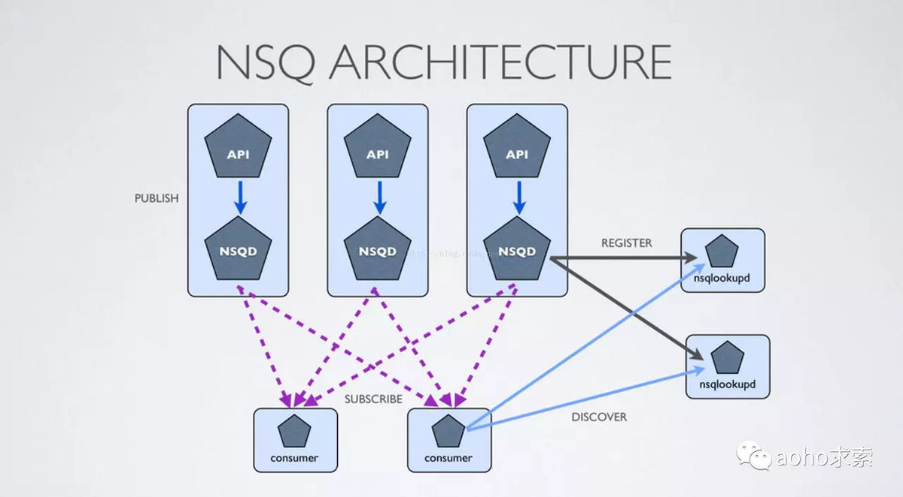
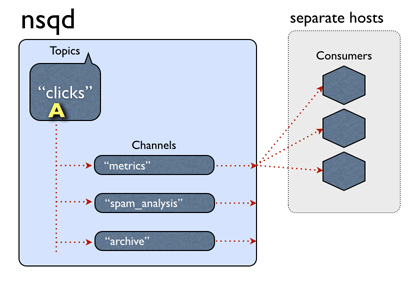
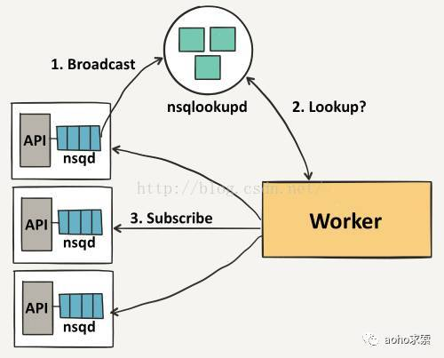
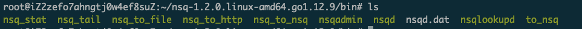
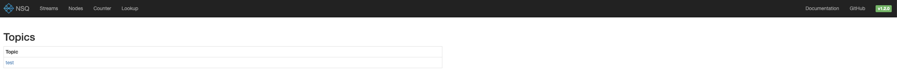
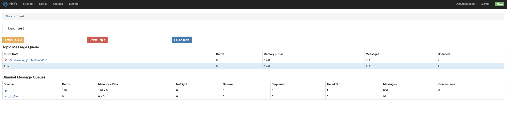
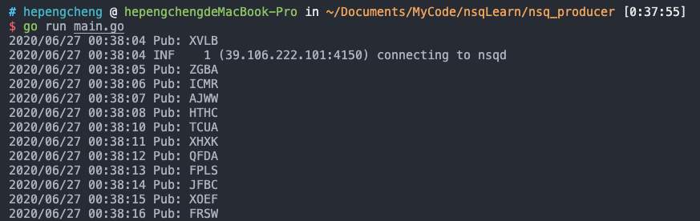
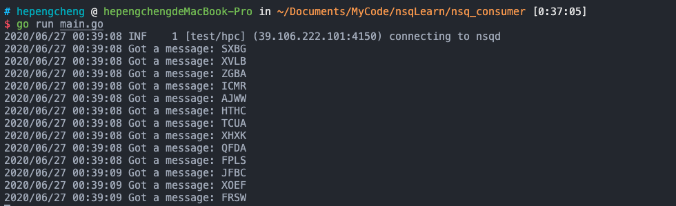

# NSQ使用入门

## 简介

消息队列是进程间通信或同一进程不同线程间进行通信一种方式，可以将服务异步化，对流量进行整形，削峰填谷，是高并发、大数据场景下不可或缺的中间件；使得消息生产者和消费者解耦，方便系统模块化设计。

NSQ是一个基于Go语言的分布式实时消息平台，它基于MIT开源协议发布，由bitly公司开源出来的一款简单易用的消息中间件。 官方和第三方还为NSQ开发了众多客户端功能库，如官方提供的基于HTTP的nsqd、Go客户端go-nsq、Python客户端pynsq、基于Node.js的JavaScript客户端nsqjs、异步C客户端libnsq、Java客户端nsq-java以及基于各种语言的众多第三方客户端功能库。

## 特性

1. Distributed NSQ提供了分布式的，去中心化，且没有单点故障的拓扑结构，稳定的消息传输发布保障，能够具有高容错和HA（高可用）特性。

2. Scalable易于扩展NSQ支持水平扩展，没有中心化的brokers。内置的发现服务简化了在集群中增加节点。同时支持pub-sub和load-balanced 的消息分发。

3. Ops FriendlyNSQ非常容易配置和部署，生来就绑定了一个管理界面。二进制包没有运行时依赖。官方有Docker image。

4. Integrated高度集成官方的 Go 和 Python库都有提供。而且为大多数语言提供了库。

5. 消息不持久化，全在内存。可配置--mem-queue-size来超出阈值的消息写到硬盘

6. 保证at least once投递。nsqd没挂的前提下，由于超时，连接断开，重新入队等原因，消息可能多次投递，client自己保证消费消息的操作是具有幂等性的。

7. 值得注意的是，重要的是 nsqd 和 nsqlookupd 守护进程被设计成独立运行，没有相互之间的沟通或协调。

## 概念

**Topic** ：一个topic就是程序发布消息的一个逻辑键，当程序第一次发布消息时就会创建topic。

**Channels** ：channel与消费者相关，是消费者之间的负载均衡，channel在某种意义上来说是一个“队列”。每当一个发布者发送一条消息到一个topic，消息会被复制到所有消费者连接的channel上，消费者通过这个特殊的channel读取消息，实际上，在消费者第一次订阅时就会创建channel。Channel会将消息进行排列，如果没有消费者读取消息，消息首先会在内存中排队，当量太大时就会被保存到磁盘中。

**Messages**：消息构成了我们数据流的中坚力量，消费者可以选择结束消息，表明它们正在被正常处理，或者重新将他们排队待到后面再进行处理。每个消息包含传递尝试的次数，当消息传递超过一定的阀值次数时，我们应该放弃这些消息，或者作为额外消息进行处理。

**nsqd**：nsqd 是一个守护进程，负责接收，排队，投递消息给客户端。它可以独立运行，不过通常它是由 nsqlookupd 实例所在集群配置的（它在这能声明 topics 和 channels，以便大家能找到）。

**nsqlookupd**：nsqlookupd 是守护进程负责管理拓扑信息。客户端通过查询 nsqlookupd 来发现指定话题（topic）的生产者，并且 nsqd 节点广播话题（topic）和通道（channel）信息。有两个接口：TCP 接口，nsqd 用它来广播。HTTP 接口，客户端用它来发现和管理。注：是消费者查询去哪里取消息，而不是生产者查询生产消息到哪里去

每个nsqd具有与nsqlookupd的长期TCP连接，在该连接上它定期推送其状态。此数据用于通知nsqlookupd将为消费者提供哪些nsqd地址。对于消费者，将公开HTTP /查找端点以进行轮询。

对于nsqlookupd，通过运行多个实例来实现高可用性。它们不直接相互通信，数据被认为最终是一致的。消费者轮询所有已配置的nsqlookupd实例并将响应联合起来。陈旧，不可访问或其他故障节点不会使系统停止运行。

**nsqadmin**：nsqadmin 是一套 WEB UI，用来汇集集群的实时统计，并执行不同的管理任务。 常用工具类：

**nsq_to _file**：消费指定的话题（topic）/通道（channel），并写到文件中，有选择的滚动和/或压缩文件。

**nsq_to _http**：消费指定的话题（topic）/通道（channel）和执行 HTTP requests (GET/POST) 到指定的端点。

**nsq_to _nsq**：消费者指定的话题/通道和重发布消息到目的地 nsqd 通过 TCP。

## 拓扑结构

NSQ推荐通过他们相应的nsqd实例使用协同定位发布者，这意味着即使面对网络分区，消息也会被保存在本地，直到它们被一个消费者读取。更重要的是，发布者不必去发现其他的nsqd节点，他们总是可以向本地实例发布消息。



首先，一个发布者向它的本地nsqd发送消息，要做到这点，首先要先打开一个连接，然后发送一个包含topic和消息主体的发布命令，在这种情况下，我们将消息发布到事件topic上以分散到我们不同的worker中。 事件topic会复制这些消息并且在每一个连接topic的channel上进行排队，在我们的案例中，有三个channel，它们其中之一作为档案channel。消费者会获取这些消息并且上传到S3。



每个channel的消息都会进行排队，直到一个worker把他们消费，如果此队列超出了内存限制，消息将会被写入到磁盘中。Nsqd节点首先会向nsqlookup广播他们的位置信息，一旦它们注册成功，worker将会从nsqlookup服务器节点上发现所有包含事件topic的nsqd节点。



然后每个worker向每个nsqd主机进行订阅操作，用于表明worker已经准备好接受消息了。这里我们不需要一个完整的连通图，但我们必须要保证每个单独的nsqd实例拥有足够的消费者去消费它们的消息，否则channel会被队列堆着。

## 环境搭建及使用

本实验全部基于 Ubuntu20.04

NSQ官方文档地址为：https://nsq.io/overview/design.html

1. 由于 NSQ 是用 golang 编写，所以安装非常简单，只需要去 github 上下载编译好的可执行二进制文件即可。[点击这里](https://github.com/nsqio/nsq/releases)

2. 下载好后解压，你会得到如下文件:

   

3. 运行` nsqlookupd`（提供服务注册与发现功能，是nsq可扩展的基础，提供最终一致性服务发现服务）

   ```
   ./nsqlookupd
   ```

4. 运行 `nsqd`（nsqd是nsq最重要的组件，主要负责接收生产者发送的消息、消息持久化落盘、消息分发对应的消费者等功能）

   ```
   nsqd --lookupd-tcp-address=127.0.0.1:4160
   ```

5. 运行 `nsqadmin`（提供简单的可视化管理界面）

   ```
   nsqadmin --lookupd-http-address=127.0.0.1:4161
   ```

6. 用HTTP接口，创建一个topic并发送消息

   ```
   curl -d 'hello world 1' 'http://127.0.0.1:4151/pub?topic=test'
   ```

7. 使用 `nsq_to_file` ，把 topic 的消息存在指定目录中

   ```
   nsq_to_file --topic=test --output-dir=/tmp --lookupd-http-address=127.0.0.1:4161
   ```

此时，打开浏览器`http://127.0.0.1:4171/ `来查看简易的管理页面（端口是4171，ip地址如果是云服务器部署的，则填云服务器地址）。

不出意外的话，会看到这样



点击对应的topic，可以看到相关的 channel 信息



里面可以看到当前channel的消息积压，以及一共有多少条消息。

## 生产者和消费者代码

因为我平时使用 Golang 比较多，NSQ也是用GO语言编写的，所以使用golang来进行简单的 producer 和 consumer 编写，使用的sdk为：github.com/nsqio/go-nsq

### 生产者代码

此代码首先初始化了NSQ的IP和端口，然后每次从26个子母中随机生成四个送入topic为`test`的队列中

```go
package main

import (
	"log"
	"math/rand"
	"time"

	"github.com/nsqio/go-nsq"
)

func main() {
	config := nsq.NewConfig()
	w, err := nsq.NewProducer("39.106.222.101:4150", config)

	if err != nil {
		log.Panic(err)
	}

	chars := []byte("ABCDEFGHIJKLMNOPQRSTUVWXYZ")

	for {
		buf := make([]byte, 4)
		for i := 0; i < 4; i++ {
			buf[i] = chars[rand.Intn(len(chars))]
		}
		log.Printf("Pub: %s", buf)
		err = w.Publish("test", buf)
		if err != nil {
			log.Panic(err)
		}
		time.Sleep(time.Second * 1)
	}
}
```

使用效果：



### 消费者代码

消费者首先指定了topic为`test`以及`channel`为`hpc`进行消费，然后使用250个协程，用AddHandler添加一个消费处理函数，在处理函数中会打印这个消息分别消费一个消息，并把消息打印到标准输出

```go
package main

import (
	"log"
	"sync"

	"github.com/nsqio/go-nsq"
)

func main() {

	wg := &sync.WaitGroup{}
	wg.Add(250)

	config := nsq.NewConfig()
	q, _ := nsq.NewConsumer("test", "hpc", config)

	q.AddHandler(nsq.HandlerFunc(func(message *nsq.Message) error {
		log.Printf("Got a message: %s", message.Body)
		wg.Done()
		return nil
	}))

	err := q.ConnectToNSQD("39.106.222.101:4150")
	if err != nil {
		log.Panic(err)
	}
	wg.Wait()

}

```

使用效果：



可以看到，已经消费到了之前生产者生产的消息。

## 其他

1. 官方推荐nsqd和producer进程部署在同一机器
2. 与kafka的对比：kafka适用于更大吞吐量，保证有序的场景，nsq适用于实时消费的场景，但不在乎顺序性
3. NsqAdmin没有鉴权，任何知道NsqAdmin地址的同学都可以操作（删除topic/channel、清空topic/channel），安全性需要自己通过其他方式来保证

## 参考资料

1. [NSQ官方文档](https://nsq.io/overview/design.html)
2. [使用NSQ](https://juejin.im/post/5d3e3a44f265da1bae39439a)