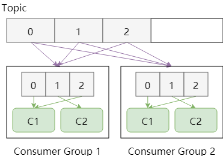
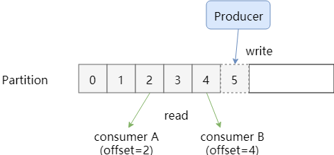
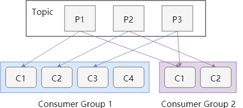
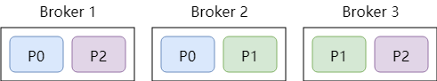

# Kafka 

## 简介

> Apache Kafka is a distributed high throughput message system
>
> Apache Kafka is a distributed streaming platform

Apache Kafka是一个分布式发布 - 订阅消息系统和一个强大的队列，可以处理大量的数据，并使您能够将消息从一个端点传递到另一个端点。 Kafka适合离线和在线消息消费。 Kafka消息保留在磁盘上，并在群集内复制以防止数据丢失。 Kafka构建在ZooKeeper同步服务之上。 它与Apache Storm和Spark非常好地集成，用于实时流式数据分析。

## 设计理念

- 低延迟：以时间复杂度 O(1) 的方式提供消息处理能力，即使对 TB 以上的数据也能保证常数时间复杂度的访问性能
- 高吞吐：即使在非常廉价的商用机器上也能做到单机支持每秒十万条以上的消息传输
- 水平扩展：支持 Kafka Broker 间的消息分区，及分布式消费，同时支持在线水平扩展
- 顺序性：保证每个 Partition 内的消息顺序传输
- 多场景：同时支持离线数据处理和实时数据处理

## kafka基础

- Kafka引入了 Consumer Group模式来进行工作

  - 一个Group内可以有多个消费者，Group内的消费者以队列模式进行工作

    

- Partition与消费模型

  - Kafka中的一个topic是被打散分配在多个Partition中存储的，Consumer Group在消费时需要从不同的Partition中获取消息，如何重建Topic中的顺序呢

    - 没有办法，Kafka只保证消息在Partition中有序，而不管全局情况

  - Partition中的消息可以被不同的Group多次消费，那Partition中被消费的消息是何时删除的？Partition是如何知道一个Consumer Group的消费位置呢？

    - 无论是否被消费，除非消息到期，Partition从不删除消息。例如设置保留时间为2天，那么2天内的任何Group都可以被消费，2天后，消息被自动删除。

    - Partition会为每一个Consumer Group保存一个偏移量，记录Group的消费位置：

      - 消费位置图

        

  - Group中的Consumer是如何与Partition对应的

    - 同一个Consumer Group中，一个partition只能被一个consumer消费

    - 推论1：如果Consumer的数量大于partition的数量，则会consumer是空闲的

    - 推论2：如果Consumer的数量小于partition的数量，则一个consumer可能会消费多个partition

    - 消费关系对应图

      

- 物理存储

  - 上面的Topic Partition都是抽象概念，最终每一个partition都要存储在物理机上，kafka把这样的物理机称为 Broker，可以是一台物理机，也可以是一个集群

  - 物理机可能损坏，所以我们要进行一定的数据冗余

    

  - 同一个Partition有多个副本，并分布在不同的broker，那么producer要写入在哪个副本上呢？consumer要从哪个副本进行读取呢？

    - kafka的各个broker要和zookeeper进行通信，每一个partition的多个副本之间通过partition的leader的选举机制选出**主副本**，所有的读写都通过主副本来进行
    - 其他冗余的副本会从主副本上同步消息。就像其他Consumer一样

- 总结

  - Topic 是顶级概念，对应于一个消息队列。
  - Kafka 是以 Partition 为单位存储消息的，Consumer 在消费时也是按 Partition 进行的。即 Kafka 会保证一个 Consumer 收到的消息中，来自同一个 Partition 的所有消息是有序的。而来自不同 Partition 的消息则不保证有序。
  - Partition 会为其中的消息分配 Partition 内唯一的 ID，一般称作偏移量(offset) 。Kafka 会保留所有的消息，直到消息的保留时间（例如设置保留 2 天）结束。这样 Consumer 可以自由决定如何读取消息，例如读取更早的消息，重新消费等。
  - Kafka 有 Consumer Group 的概念。每个 Group 独立消费某个 Topic 的消息，互相不干扰。事实上，Kafka 会为每个 Group 保存一个偏移量，记录消费的位置。每个 Group 可以包含多个 Consumer，它们共同消费这个 Topic。
  - 对于一个 Consumer Group，一个 Partition 只能由 Group 中的一个 Consumer 消费。具体哪个 Consumer 监听哪个 Partition 是由 Kafka 分配的。算法可以指定为 Range 或 RoundRobin。
  - 物理上，消息是存在 Broker 上的，一般对应为一台物理机或集群。存储时，每个 Partition 都可以有多个副本。它们会被“均匀”地存储在各个 Broker 中。
  - 对于一个 Partition，它的多个复本存储一般存储在不同 Broker 中，在同一时刻会由 Zookeeper 选出一个主副本来负责所有的读写操作。
  - 另外，随着 Kafka 的发展，它的定位已经从“分布式消息队列”变成了“分布式流处理平台”，添加了 Connector 及 Stream Processor 的概念。只是这些并不改变它的基本概念和结构。

## 参考资料

- [Kafka简明教程](https://zhuanlan.zhihu.com/p/37405836)
- https://lotabout.me/2018/kafka-introduction/