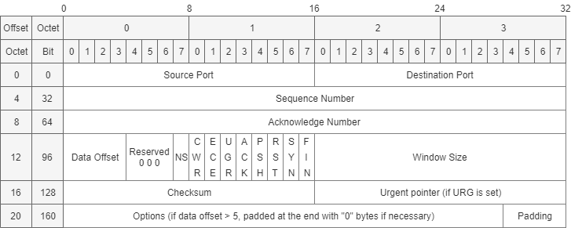
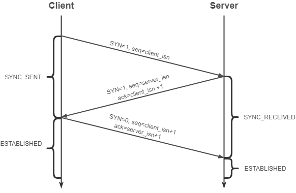
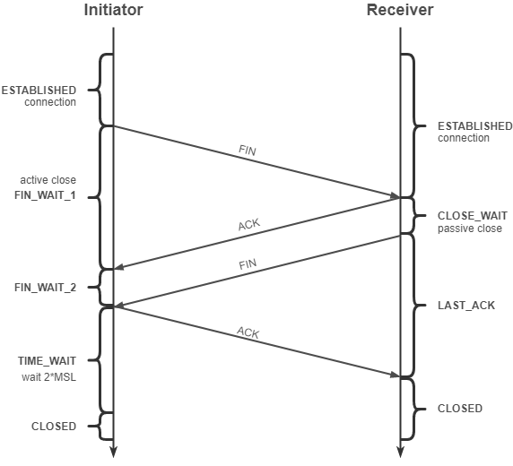
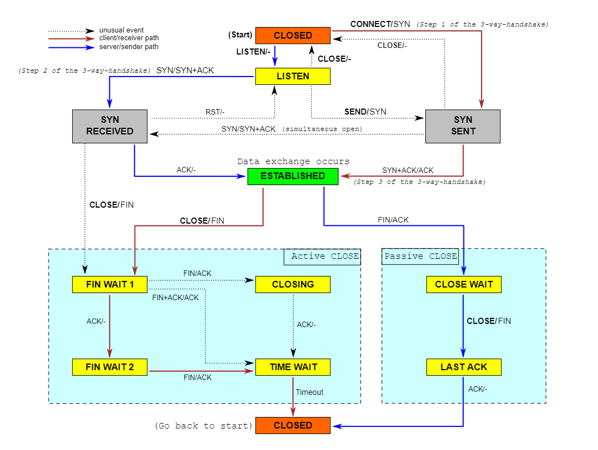

# TCP三次握手、四次挥手

三次握手四次挥手知识点复习

---

- TCP报文头

  - 格式：

    

  - source port/destination port 分别代表源端口和目标端口

  - sequence/acknowledge number 用来标记发送和接收的字节数(序列号和ACK)

  - data offset 占 4 位，代表报文头中的字(32位)数，如果没有 options，则为固定值5

  - Flags，共 9 位

    - NS、CWR、ECE、URG，不懂
    - ACK，设置了后表示 acknowledge 字段生效
    - PSH，要求将缓存的数据推送给接收方
    - RST，重置连接，比如接收方已经关闭连接，收到迟到的报文，则会重置报文
    - SYN，三次握手第一次，代表同步 sequence number
    - FIN，四次挥手时的结束报文

  - Window size，拥塞控制中的窗口大小

  - Checksum，校验码，用于传输检测过程中的错误

  - Urgent pointer，不懂

  - Options，一般在三次握手、四次挥手中用到。不懂

- 三次握手

  - 客户端随机生成一个序列号（sequence number），并发送SYN报文到服务端，请求连接

  - 服务端发送 SYN+ACK ，在应答请求的同时，也生成一个sequence id，请求同步

  - 客户端应答，服务端收到应答后双方建立连接

    

  - 示意图

    

  - 正如SYN标志的研一，三次握手的过程在建立连接的过程中完成了自身初始 sequence number同步。使用随机生成的 sequence number是为了防止网络中滞后的报文影响建立新的连接。

  - 为什么要进行三次握手，而不是两次？

    - 因为信道不可靠。考虑两次握手。假设客户端发送的第一个SYN在网络中滞留了，客户端因此重发SYN并建立连接，使用指导释放。此时滞留的第一个SYN终于到了，根据两次握手的规则，服务器直接进入 ESTABLISHED 状态，而此时客户端根本没有连接，不会理会服务端发送的报文，白白浪费了服务端的资源。
    - 事实上，只要信道不可靠，双方永远没有办法确认对方知道自己将要进入连接状态。例如三次握手，最后一次ACK如果丢失，则只有客户端进入连接状态。四次、五次多少次都有类似问题，三次是理论和实际的一个权衡。

- 四次挥手

  断开连接需要四次挥手，可以有客户端也可以有服务器发起

  - \1. 发起方发送 FIN 报文，代表断开连接

  - \2. 接收方响应 ACK 报文，并在自己发送完未处理的报文后发送FIN报文

  - \3. 发起方接受ACK报文后等待接收方的FIN报文，收到后发送ACK报文，自己进入 TIME_WAIT 状态，等待 2MSL 后关闭连接

  - \4. 接收方收到ACK报文，关闭连接

  - 四次挥手示意图

    

  - 为什么需要四次挥手？

    - 一般是因为连接是双向的， 每一方关闭连接时需要 FIN+ACK。因此一共四次。而从上图来看，主要是因为接收方发送ACK和发送FIN之间有间隔，接收方需要等待应用程序处理后发送FIN报文。如果ACK+FIN一起发送，则就变成三次挥手了。

  - 在做短连接做压测的时候经常会出现大量端口处理 TIME_WAIT 状态，导致无端口可用。为什么需要这个状态？

    - \1. 防止滞后的报文被后续建立的连接接收，因此结束先等待 2MSL 的时间。（MSL 是最大的报文存活时间，一来一回可以认为与上次连接相关的报文都不在网络中了）
    - \2. 确保接收方已经正确关闭连接，考虑发起方最后一次 ACK 滞留，则接收方一直处于 LAST_ACK 状态，而不会关闭连接。那么此时发送方重新建立连接 SYN，则由于序列号不同，处于 LAST_ACK 的接收方会响应 RST 报文。即连接未正确关闭导致后续连接无法建立。

- 状态转换图：

  